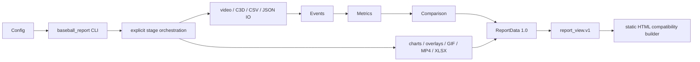

# Architecture

This repository is one config-driven monolith, not a service mesh. The package
owns stable contracts and reusable rules; compatibility scripts still own
characterized legacy computations and rendering.

Ownership details are in `docs/target_architecture.md`; completed migration
evidence is in `docs/stage1_configuration.md` through
`docs/stage11_cli.md`.

Key invariants: Vicon is authoritative for displayed biomechanics; pose is
alignment/visual only; current side profile is right batting/right throwing;
coordinates remain `legacy_vicon_z_up_mm`; hand speed is not ball speed; the
Git-tracked Bryan pitching `index.html` is the canonical template.
