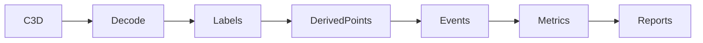

# C3D / Vicon Pipeline

C3D is read by the existing reader in `scripts/build_vicon_2026_metrics.py`
and adapted by `baseball_report.io.c3d`. The preserved contract includes point
labels, raw labels, frame rate/count, first source frame, millimetres, invalid
sample handling, and no implied analog/force/event support.

Coordinates remain the explicitly named `legacy_vicon_z_up_mm` profile.
Physical global X/Y meaning and vendor angle-channel semantics remain
unverified and are not reinterpreted. See `docs/stage2_motion_io.md` and
`docs/stage4_point_mappings.md`.
