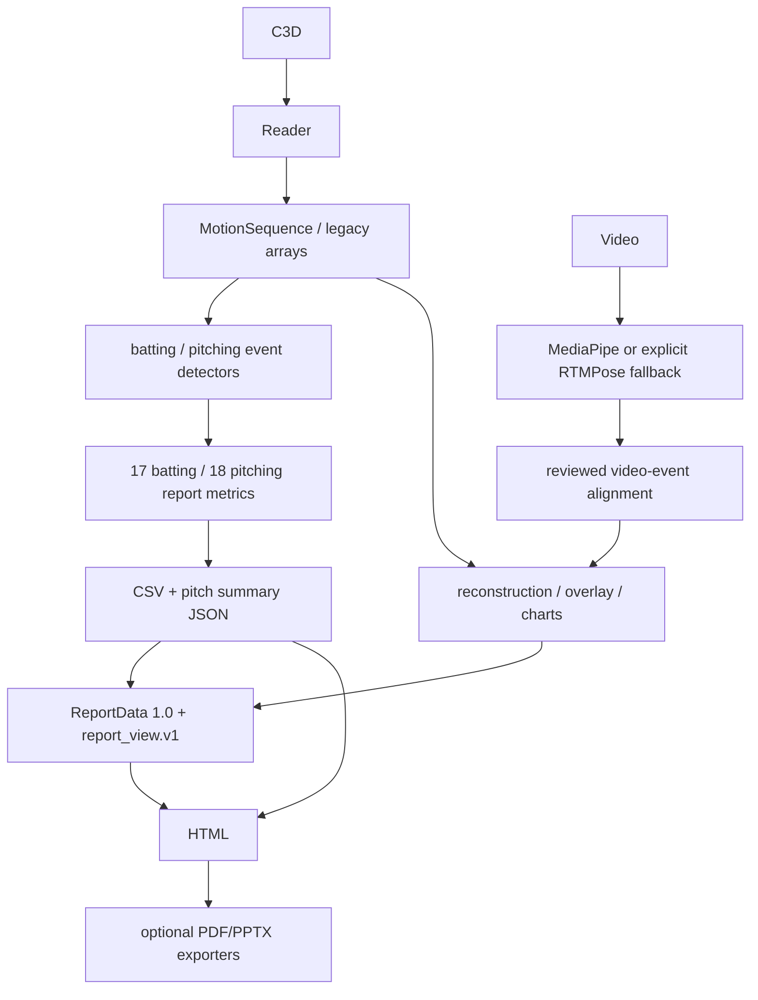

# Data Flow

Frame identities remain distinct: loaded zero-based sequence index, original
C3D header frame, reviewed source-video frame, timestamp, and display frame.
No layer infers conversion between them without explicit metadata.
