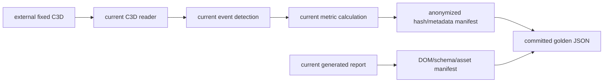

# Phase 4 — Characterization Baseline

> Repository: `baseball-report-generation`
>
> Branch: `refactor/systematic-engineering`
>
> Completed: 2026-07-17

## Changes Made

Phase 4 records the behavior of the current producers before any event,
metric, C3D, pose, builder, or report-generation implementation is migrated.
It does not redirect a public entry point.

- Added small synthetic C3D fixtures for floating-point and positive-scale
  point storage.
- Characterized both current C3D readers, including label cleanup, source
  frame metadata, units, invalid samples, marker aliases, and their divergent
  support boundaries.
- Locked the current batting event rules and all 17 report metric outputs.
- Locked the current pitching event rules, all 41 generated values, and the 18
  report-facing metric definitions.
- Characterized MediaPipe and RTMPose transport rows, missing-pose behavior,
  reviewed frame precedence, and video/C3D frame alignment.
- Added structural contracts for the Git-tracked authoritative pitching
  template at `reports/pitching_bryan_coach/index.html`, the batting workbook,
  and local combined report assets.
- Added opt-in protected baselines for one real batting C3D, one real pitching
  C3D, and one generated report artifact set.
- Added capture/verify tools that store hashes and aggregate metadata rather
  than raw personal media, absolute paths, athlete names, or full raw values.

## Files Added

- `tests/fixtures/c3d_factory.py`
- `tests/fixtures/motion_factory.py`
- `tests/characterization/test_c3d_readers.py`
- `tests/characterization/test_batting_metrics.py`
- `tests/characterization/test_pitching_metrics.py`
- `tests/characterization/test_pose_alignment.py`
- `tests/characterization/test_report_contracts.py`
- `tests/characterization/test_report_artifact_manifest.py`
- `tests/integration/test_real_characterization_baselines.py`
- `tests/golden/synthetic_batting_metrics.json`
- `tests/golden/synthetic_pitching_metrics.json`
- `tests/golden/protected_batting_case_a.json`
- `tests/golden/protected_pitching_case_a.json`
- `tests/golden/protected_report_case_a.json`
- `tools/capture_characterization_baseline.py`
- `tools/capture_report_artifact_baseline.py`

Package marker files were also added under `tests/fixtures/`,
`tests/characterization/`, `tests/integration/`, and `tools/` where needed.

## Files Modified

- `docs/refactor_plan.md` records the Phase 4 implementation and exit gate.

No production algorithm, report template, builder, pipeline, config, sample
data, or public entry was modified by Phase 4.

## Data Flow Impact

There is no runtime data-flow change. Tests call current producers directly:



The protected real inputs remain outside the repository and are enabled only
through environment variables. Normal test discovery skips those cases when
the local inputs are unavailable.

## Numerical Impact

None. Event rules, event frames, formulas, values, rounding, units, coordinate
assumptions, handedness behavior, report text, and visual design were not
changed.

The fixed protected baselines currently record:

- batting: 2,136 frames, 44 points, 100 Hz, millimetres, 17 report metrics;
- pitching: 662 loaded frames, 191 points, 100 Hz, millimetres, four events,
  41 generated values, and 18 report metrics;
- report artifacts: batting/pitching schema identifiers, DOM card/section
  counts, asset inventories, chart hashes, and workbook sheet names.

Exact identities, frame indices, units, string fields, and hashes are compared
exactly. Synthetic floating-point metric values use the existing output values
with an absolute tolerance of `1e-9` where appropriate.

## Compatibility

- Existing Python scripts and shell/Node entry points are unchanged.
- Existing CSV, JSON, HTML, XLSX, image, and builder contracts are unchanged.
- The authoritative report template remains
  `reports/pitching_bryan_coach/index.html`.
- Legacy readers and producers remain the implementations under test.
- No old script was removed or replaced.

The capture tools are test-support utilities, not new public pipeline or CLI
commands.

## Validation

The full suite was run with the repository's existing dependency environment:

```text
PYTHONPATH=src:scripts:. python -m unittest discover -s tests -v
Ran 34 tests
OK
```

The run included all three opt-in protected integrations. It also covered:

- Phase 3 model and adapter contracts;
- synthetic C3D reader behavior;
- batting and pitching event/metric baselines;
- MediaPipe/RTMPose pose and frame-alignment behavior;
- canonical HTML, local HTML asset, workbook, and artifact-manifest contracts;
- deterministic verification of both real C3D manifests and the generated
  report manifest.

The new Python files passed `py_compile`, and the staged Phase 4 changes passed
`git diff --cached --check`. The repository's native `unittest` runner was
used; direct `pytest` startup is not currently reliable in this local runtime.

## Known Issues

These are confirmed current behaviors, not guesses, and remain deliberately
unchanged in Phase 4:

1. The main C3D reader does not expose the C3D header `first_frame`, analog
   channels, or embedded events. The sync reader preserves `first_frame` but
   supports only floating-point point storage. Their invalid-sample rules also
   differ for an all-zero point.
2. Automatic event inference on a sampled pose subset returns the subset
   ordinal rather than the original source-video frame. A reviewed video frame
   bypasses that inference and remains authoritative.
3. The current local combined HTML references two absent optional geometry
   images: `ready_position_vicon_geometry_on_2d.png` and
   `contact_position_vicon_geometry_on_2d.png`. The expected absence is
   explicit in the local artifact test; it is not silently ignored.
4. The batting XLSX builder labels loaded array index plus one as a C3D frame.
   This is not reliable for files whose C3D header begins at a non-one source
   frame.
5. RTMPose is a degraded alignment/visual fallback. Its 17 COCO points are
   duplicated into a 33-row transport shape and do not become semantically
   equivalent MediaPipe landmarks; Z remains unavailable.
6. The report artifact golden manifest represents the approved local generated
   artifact set at capture time. It must be intentionally recaptured after an
   approved report regeneration or source/template change.
7. Large raw C3D/video inputs are external and opt-in, so CI without those
   protected inputs validates synthetic and structural contracts only.
8. Physical Vicon X/Y direction and vendor angle-channel semantics remain
   unverified business metadata. Existing indices and coordinate behavior are
   preserved rather than generalized.

## Next Phase

Proceed to Stage 1: configuration and path boundary. The next bounded change
will validate and resolve existing configs and paths without changing
calculation order, subprocess order, formulas, events, or report output. Each
config/path migration will be compared against the Phase 4 baselines before a
consumer is switched.
