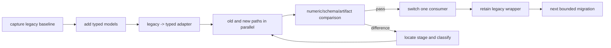
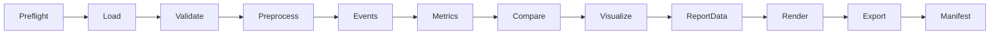

# Refactor Plan

> Repository: `baseball-report-generation`
>
> Phase: 2 — migration plan only
>
> Target design: `docs/target_architecture.md`
> Audit evidence: `docs/repository_audit.md`

## 1. Plan policy

This is a gated, incremental migration. A stage is not “complete” because
files moved; it is complete only when its compatibility and numerical checks
pass. Existing entries remain callable until their removal conditions are met.

Non-negotiable constraints:

- work remains on `refactor/systematic-engineering` or later refactor branches;
- no automatic merge to `main`;
- no event, metric, score, coordinate, unit, side, copy, or visual-design
  change is bundled with structural migration;
- no old script is deleted in early stages;
- fixed outputs are recorded before their producers are changed;
- uncertain business rules are represented as explicit assumptions/warnings,
  not silently generalized;
- only repository-configured tools are run;
- a failed gate returns the stage to comparison/debugging rather than assuming
  the new implementation is correct.

## 2. Migration strategy

Use a strangler migration inside the monolith:

1. characterize the existing system;
2. add domain contracts beside legacy dictionaries/CSV/JSON;
3. wrap old behavior in adapters;
4. migrate one responsibility at a time;
5. write both old and new artifacts when necessary;
6. compare them;
7. switch one consumer;
8. retain the old entry as a wrapper;
9. remove code only after repository-wide reference and equivalence checks.



## 3. Repository-resolved implementation constraints

These are not open product questions. They are existing contracts discovered
from configs, consumers, README and implementation and must be preserved:

| Topic | Refactor decision | Guardrail |
|---|---|---|
| frame identities | calculations keep zero-based loaded-array indices; model original C3D header frame and reviewed source-video frame separately | add metadata only; do not silently change current UI/XLSX values |
| handedness | current supported profile is right batting/right throwing (rear/front R/L; arm/drive/lead R/R/L) | validate/label the limitation; do not synthesize left-side behavior |
| coordinate convention | preserve `legacy_vicon_z_up_mm` | no conversion or generic-axis claim |
| Vicon angle channels | preserve exact legacy component indices in a versioned mapping | vendor semantics remain explicitly unverified |
| batting Contact | preserve lowest-`Bat1_Z` proxy, window, ID, value and visible name | expose provenance/warning in typed results; copy change is out of scope |
| peer inclusion | pitching includes every configured student, including subject; batting preserves current workbook membership | record member IDs in comparison provenance |
| authoritative template | latest Git-tracked `reports/pitching_bryan_coach/index.html` | capture/hash the approved working-tree version and never overwrite it in characterization tests |
| metric scope | 17 batting final and 18 pitching registry metrics are report-contract metrics; consumed auxiliary fields are contractual; unconsumed generic exports are diagnostic | classify by actual consumer and test each report-facing field |
| regression tolerance | exact indices/names/units/counts/rounded strings; initial absolute float tolerance `1e-9`; DOM/perceptual artifact checks | any relaxation requires a recorded difference and cause |
| fixture policy | raw personal media remains external and opt-in; commit synthetic/small non-identifying fixtures and golden metadata only | never add raw athlete data without explicit approval |
| output formats | HTML primary; PDF/PPTX optional post-generation exports | do not add unsupported public CLI flags |
| RTMPose | alignment/visual-only degraded fallback with provenance | do not claim full 33-landmark semantic equivalence |

Remaining non-blocking unknowns are limited to physical Vicon X/Y direction,
vendor angle-channel semantics, and separate approval for visible frame/contact
wording corrections. None requires guessing during structural migration.

## 4. Baseline matrix

At least these cases must be captured before core migration:

| Case | Purpose | Required comparison |
|---|---|---|
| Bryan batting | existing canonical-like combined output, C3D first frame 1 | 17 metrics/events/report/asset set |
| Branden batting | non-1 C3D first frame and reviewed video anchor | array vs source frame identity, 17 metrics/alignment |
| James or Youyou batting | another non-1 first frame and different marker count | missing-marker and derived-point behavior |
| Bryan pitching | current template subject and C3D first frame 690 | template binding, four events, 18 report metrics |
| Xuanxuan pitching | non-1 first frame, non-template subject | frame identity and stale-subject checks |
| one MediaPipe success output | 33-landmark path | CSV schema/count/visibility/alignment |
| one RTMPose fallback output | capability-degraded pose path | schema/provenance/mapping, visual-only use |
| missing optional metric/asset fixture | fallback behavior | schema status, builder survival |

Large raw media tests are opt-in integration tests; small extracted fixtures
cover unit and contract behavior in normal CI/developer runs.

## 5. Phase 3 — core data contracts before code movement

### Scope

Add the smallest package skeleton and immutable data models. Do not redirect
the public pipeline yet.

### Planned changes

- introduce `src/baseball_report/` packaging boundary;
- add minimal package metadata needed for an editable `src/` install, without
  replacing the repository's existing runtime or test toolchain;
- add enums/IDs for source, motion, side, coordinate profile and quality;
- add `FrameReference`, `FrameWindow`, `MotionSequence`, `AnalysisContext`;
- add `MotionEvent`, `EventCollection`;
- add `MetricDefinition`, `MetricResult`, `ComparisonResult`;
- add `ChartArtifact`, `ReportAsset`, `ReportSection`, `ReportData`;
- add `StageResult`, warnings and exception hierarchy;
- add serialization/validation tests for models;
- add read-only adapters from representative current batting CSV and pitching
  JSON into typed results;
- use `schema_version="0.x"` internally until contract tests stabilize; do not
  advertise `1.0.0` yet.

### Explicit non-goals

- no formula migration;
- no current CSV/JSON replacement;
- no HTML builder change;
- no C3D reader change;
- no new CLI command documented as supported.

### Compatibility gate

- legacy inputs deserialize without modifying them;
- adapters preserve every current metric key/value/unit/event string;
- both frame identities can be represented without changing legacy index;
- JSON serialization is deterministic and rejects NaN/Infinity;
- existing four tests still pass.

### Rollback

New package/models are additive. If an adapter is inaccurate, no public path
uses it and it can be corrected without production output impact.

### Implementation record — 2026-07-17

Status: complete on `refactor/systematic-engineering`.

- Added the additive `src/baseball_report/` package and minimal `pyproject.toml`.
- Added immutable frame, motion, context, warning/provenance, event, metric,
  comparison, visualization, report and stage-result contracts.
- Kept the internal report contract at `schema_version="0.x.y"`; `1.0.0` is
  rejected until later contract stabilization.
- Added deterministic JSON serialization that rejects NaN/Infinity and
  report-root-relative asset validation.
- Added read-only adapters for current long-form batting CSV and pitching
  summary JSON. No production script imports or writes through these adapters.
- Verified a current Bryan artifact set without rewriting it: 153 batting
  metric rows across 9 trials were preserved, as were all 41 pitching value
  keys for each of 9 athletes and the 18 report-facing pitching definitions.
- Added 7 Phase 3 tests; all 4 pre-existing tests remain passing.

Detailed completion evidence is recorded in `docs/phase3_contracts.md`.

## 6. Phase 4 — characterization tests and golden contracts

### Scope

Record current behavior before any producer is replaced.

### Unit/characterization tests

#### C3D

- floating and positive-scale point decode where fixtures allow;
- labels, raw labels, unit, rate, point/frame counts;
- original `first_frame`, last frame and sequence-index mapping;
- residual/all-zero invalid behavior;
- marker alias averaging and all-missing behavior;
- current files with zero analog samples;
- explicit rejection/unsupported metadata for analog/event use.

#### Batting events/metrics

- swing raw/expanded window;
- Ready window, primary frame and fallback;
- Contact proxy window and fallback;
- high-speed zone;
- all 17 values, units, event names/windows, formulas and component JSON;
- right-handed assumption;
- missing-point behavior;
- wide CSV field order.

#### Pitching events/metrics

- peak knee, foot contact, foot plant, release indices/order;
- all 18 registry values and auxiliary values used by report/assets;
- fixed Vicon angle channel indices;
- score/status/reference behavior;
- right-arm/L-lead assumption;
- summary JSON and CSV shape/order.

#### Pose/alignment

- 33 output rows per processed frame for MediaPipe;
- RTMPose duplicated mapping and blank Z behavior;
- missing pose rows;
- playback FPS vs reviewed capture FPS;
- array/C3D/video frame mapping;
- manual anchor takes precedence over automatic wrist peak;
- automatic subset-frame inference is characterized as current behavior before
  deciding whether it is a bug fix.

#### Report contracts

- required metric/event IDs;
- section and card counts/order;
- player/coach reference placement;
- local asset references and copied pitch assets;
- optional missing-data/asset fallback;
- peer roster membership and range calculations;
- HTML builder and post-polish invariants;
- XLSX sheet names/order/metric IDs;
- chart data arrays before rendering.

### Golden artifacts

For each approved fixed case, store a compact manifest containing:

- input identity/hash and config hash;
- frame/rate/unit/coordinate assumptions;
- event indices/windows;
- metric values/units/components;
- report schema summary;
- DOM section/card summary;
- chart-data hashes;
- generated artifact names, types, sizes and counts;
- optional image perceptual hashes/screenshots where stable.

Do not commit private raw paths or large personally identifying media without
approval.

### Tolerance policy

- frame/event indices and string IDs: exact;
- integer counts and units: exact;
- unchanged Python functions: initially `abs_tol=1e-9`, adjusted only with
  documented evidence of platform/library variance;
- rendered pixel output: perceptual/structural comparison, not byte equality;
- HTML: normalized DOM/semantic comparison plus selected exact strings;
- asset lists: exact for a fixed configuration unless platform codec variants
  are documented.

### Exit gate

No core producer migration starts until at least one batting and one pitching
fixed case pass characterization tests and all current public inputs have a
documented fixture strategy.

### Implementation record — 2026-07-17

Status: complete on `refactor/systematic-engineering`.

- Added synthetic C3D, motion, event, metric, pose, HTML, XLSX, and artifact
  characterization fixtures/tests without changing a production producer.
- Locked all 17 current batting report metrics and the four pitching events,
  41 generated pitching values, and 18 report-facing pitching metrics.
- Added opt-in protected baselines for one real batting C3D, one real pitching
  C3D, and one generated report artifact set. Golden files contain anonymized
  hashes and aggregate metadata, not raw personal media or absolute paths.
- Verified the Git-tracked `reports/pitching_bryan_coach/index.html` contract
  and current report/workbook consumer shapes.
- Ran 34 tests with all protected integrations enabled; all passed.
- Confirmed and recorded existing reader, frame-identity, RTMPose, workbook,
  and missing-asset limitations instead of changing them during baseline work.

The Phase 4 exit gate is satisfied. Completion evidence and known issues are
recorded in `docs/phase4_characterization.md`.

## 7. Stage 1 — configuration and path boundary

### Scope

Centralize path/config validation without changing calculations or subprocess
sequence.

### Planned changes

- adapt current final, batting and pitching JSON into validated config models;
- retain current relative-path semantics through tests;
- preflight source/model/template/output dependencies;
- add explicit coordinate/units/handedness assumptions to runtime context;
- add dry-run resolution and output summary internally;
- add overwrite safety checks, initially advisory for existing entries;
- centralize Matplotlib/cache environment defaults;
- document external sibling dependencies rather than importing sibling code.

### Compatibility

`scripts/report_cli.py` continues accepting the same commands/configs. It may
call a config adapter but produces identical subprocess commands.

### Implementation record — 2026-07-17

Status: complete on `refactor/systematic-engineering`.

- Extended the existing compatibility config boundary with frozen final,
  batting, pitching-alignment, manifest-athlete, and preflight models.
- Removed current-working-directory dependence from public final-config
  resolution while preserving repository-relative `root_dir` behavior and
  manifest-relative C3D paths.
- Added cross-config player/C3D identity checks, output isolation checks,
  reviewed timing validation, and explicit warnings for existing outputs,
  missing peer directories with a known fallback, and template/output overlap.
- Added a read-only `--dry-run` to `pitching`, `batting`, and `final` without
  changing producer commands or final pitching-then-batting order.
- Centralized the existing Matplotlib/cache environment defaults.
- All six tracked final configs passed real dry runs; the full 44-test suite,
  including protected Phase 4 baselines, passed unchanged.

Completion evidence is recorded in `docs/stage1_configuration.md`.

### Validation

- snapshot resolved paths for all checked-in configs;
- fail malformed/missing paths before stage execution;
- prove config overrides match current behavior;
- no report tree is written in dry-run mode.

### Exit condition

All production path resolution occurs through one tested boundary; module
defaults remain only for direct legacy utilities.

## 8. Stage 2 — canonical frame and motion metadata

### Scope

Introduce `MotionSequence` and frame provenance around the current main C3D
reader without changing its point arrays.

### Planned changes

- wrap current `read_c3d` output in canonical IO/domain models;
- retain first/last C3D header frames;
- carry sequence index, source frame and relative timestamp;
- record unit, coordinate profile, storage type, labels and validity;
- write an optional new metadata/manifest artifact alongside legacy CSVs;
- keep legacy CSV columns and indices unchanged;
- adapt pose CSV into a pose sequence with backend capabilities.

### Numerical gate

- point arrays and NaN masks are element-wise identical;
- legacy `frame_index` and timestamps are identical;
- new `source_frame_number` is validated against header only;
- no report display uses the new source frame yet.

### Exit condition

All new event/metric code can receive an in-memory motion model without file
paths, while legacy consumers still receive the same CSVs.

### Implementation record — 2026-07-17

Status: complete on `refactor/systematic-engineering`.

- Added canonical C3D header inspection and a zero-copy-semantics adapter from
  current legacy arrays into immutable `MotionSequence` point/validity series.
- Added explicit loaded-index, source-frame, timestamp, unit, coordinate,
  storage, scale, label, residual, and provenance metadata.
- Added MediaPipe/RTMPose pose-row adaptation with explicit non-contiguous
  source frames and backend capabilities.
- Added an opt-in motion metadata manifest without changing default legacy CSV
  output or public report execution.
- Verified protected batting and pitching point arrays/NaN masks with zero
  tolerance; the complete 51-test suite and report artifact baselines passed.

Completion evidence is recorded in `docs/stage2_motion_io.md`.

## 9. Stage 3 — separate IO from geometry/time-series primitives

### Scope

Extract duplicated pure math behind tests.

### Candidate groups

1. finite mean/scalar and marker averaging;
2. velocity/speed conversion;
3. angle-at/flexion/plane/wrapped difference;
4. signed angle about axis;
5. smoothing and explicit missing-data policies;
6. height/floor and derived-point helpers.

### Migration rule

Migrate one group at a time. For each function:

- name its input coordinate/unit expectation;
- preserve exact NumPy operation order where floating equivalence matters;
- keep behavior variants separate if they are not equivalent;
- switch one caller, compare, then switch the next;
- do not force plotting-specific interpolation into analysis primitives.

### Exit condition

Metric/event modules can use shared tested primitives, while visualization no
longer contains copied metric formulas.

### Implementation record — 2026-07-17

Status: complete for the first parity-proven primitive group on
`refactor/systematic-engineering`.

- Added pure finite reduction, speed/velocity, joint/vector/XY/circular angle,
  and signed-axis-angle functions.
- Switched the batting metric producer, generic Vicon metric producer, and
  annotated-speed visualization through compatibility wrappers.
- Preserved the legacy direct-division joint-angle variant separately and did
  not merge non-equivalent smoothing/interpolation implementations.
- Verified wrapper arrays with zero tolerance and passed all 56 tests,
  including protected metrics and report artifacts.

Completion evidence and intentionally distinct variants are recorded in
`docs/stage3_kinematics.md`.

## 10. Stage 4 — point and channel mapping

### Scope

Centralize current mappings as `legacy_v1` data.

### Planned mapping sets

- 33 MediaPipe landmarks;
- RTMPose COCO17-to-report mapping and capability flags;
- Vicon marker aliases used by batting/pitching/reconstruction;
- derived head, wrist, hip, shoulder, trunk, foot and COM points;
- Vicon `*Angles` channel names/components;
- side/lead/trail/rear/front role mapping;
- render-only skeleton edges separately from analysis-point mappings.

### Compatibility gate

- fallback order and averaging exactly match current code;
- missing aliases yield the same NaN values plus new warnings;
- all currently observed marker sets resolve the same derived trajectories;
- no assumption is labeled generic if it is right-side-only.

### Implementation record — 2026-07-17

Status: complete for the currently exercised pose, batting, pitching-channel,
and reconstruction mappings on `refactor/systematic-engineering`.

- Added a versioned `legacy_v1` registry while retaining legacy module
  constants and public script behavior.
- Centralized 33 MediaPipe report landmarks, RTMPose adaptation, batting and
  pitching aliases/channels, explicit right-handed profiles, Vicon marker
  groups, and separate render-only topologies.
- Switched current pose alignment/rendering, batting point lookup, and Vicon
  reconstruction consumers without changing marker fallback order.
- Locked pre-refactor reconstruction definitions at 44 body segments, 83
  model edges, 39 raw markers, and seven part groups.
- Passed all 60 tests, including protected event, metric, report, and artifact
  characterization.

Completion evidence and remaining right-side limitations are recorded in
`docs/stage4_point_mappings.md`.

## 11. Stage 5 — event registry and detectors

### Order

1. generic key-pose events;
2. batting swing segment;
3. batting Ready;
4. batting Contact proxy/high-speed zone;
5. pitching peak knee;
6. pitching foot contact/plant;
7. pitching release proxy;
8. video/sync anchors.

### Method

- wrap the existing function first and return typed event results;
- keep exact thresholds, smoothing and fallback rules;
- store current rule text and detector version;
- retain current legacy dictionaries/CSV fields through adapters;
- compare event windows/primary indices across fixed trials;
- do not unify differently defined events merely because names are similar.

### Compatibility wrappers

Old functions remain and either call the new detector or are called by an
adapter. No old CLI changes its output field names during this stage.

### Exit condition

Every report-facing event has one registry owner, typed result, fixture and
known consumers.

### Implementation record — 2026-07-17

Status: complete for all currently report-facing and alignment-anchor events
on `refactor/systematic-engineering`.

- Added immutable versioned event/window results and legacy adapters.
- Centralized batting Swing, Ready, Contact proxy; pitching Peak Knee, Foot
  Contact, Foot Plant, Release proxy; and Vicon/2D alignment anchors.
- Preserved thresholds, smoothing, windows, primary-frame rounding, rule IDs,
  user-reviewed video override behavior, and all fallbacks.
- Passed all 66 tests including exact batting/pitching event golden frames and
  complete downstream metric/report characterization.

Completion evidence and proxy limitations are recorded in
`docs/stage5_event_detection.md`.

## 12. Stage 6 — metric registry and calculators

### Migration groups

#### Batting

1. Ready lower-body geometry;
2. Ready torso/bat/hand geometry;
3. Contact speed and attack angle;
4. Contact pelvis/torso/front-knee geometry;
5. Ready-to-Contact head displacement;
6. coach flag proxies;
7. hitting-zone stability;
8. shared time-series for charts/GIFs.

#### Pitching

1. peak-knee height and angle channels;
2. stride/foot-plant metrics;
3. elbow/shoulder landing metrics;
4. front/rear knee release changes;
5. release-arm geometry and height;
6. hand-speed proxy;
7. hip-shoulder separation metrics;
8. auxiliary values used by issues/charts/assets.

### Per-metric gate

Each migrated metric must have:

- registry ID and version;
- bilingual names already used by the report;
- exact current formula text;
- required point/channel/event IDs;
- unit/coordinate/side/missing-data declaration;
- legacy value equivalence test;
- result-to-current-CSV/JSON adapter;
- consumer list (cards, charts, overlays, XLSX, narrative).

### Exit condition

No final visualization or builder recalculates a migrated metric/time series.
Generic/diagnostic metrics remain separately labeled until disposition is
approved.

### Implementation record — 2026-07-17

Status: complete for all current batting report metrics, pitching report and
auxiliary metrics, and generic Vicon summary units on
`refactor/systematic-engineering`.

- Added immutable `legacy_v1` registries for 17 batting and 18 pitching report
  metrics, plus 23 pitching auxiliary and 11 generic summary unit contracts.
- Declared formulas, required points/channels, events, sides, units, bilingual
  names, missing-data behavior, and current report options.
- Removed the report builder's duplicate pitching metadata table and added
  batting registry drift validation.
- Extracted parity-proven pure composite/geometry calculators while leaving
  legacy orchestration and signatures intact.
- Passed all 71 tests with all batting and pitching golden values unchanged.

Completion evidence and intentionally retained compatibility boundaries are
recorded in `docs/stage6_metric_registry.md`.

## 13. Stage 7 — explicit pipelines, stage results and logging

### Scope

Replace script-to-script orchestration internals with named pipeline stages,
without removing script entries.

### Target stage sequence



### Planned behavior

- stage functions accept typed inputs/config and return `StageResult`;
- stage artifacts are explicit rather than inferred from print output;
- logging records stage/source/trial/frame/event/metric/artifact/duration;
- expected missing data becomes structured warnings;
- bottom layers raise typed exceptions;
- only CLI returns process exit codes;
- subprocesses remain only where isolation/external runtime is justified.

### Implementation record — 2026-07-17

Status: complete for current Vicon C3D, batting, pitching, and final report
orchestrators on `refactor/systematic-engineering`.

- Added shared stage execution, structured logging, artifact validation,
  duration tracking, and atomic `pipeline_run.v1` manifests.
- Wired current public and nested pipelines without changing their child
  commands or removing any entry.
- Added opt-in manifest path/log level flags and retained non-mutating dry-run.
- Passed all 74 tests and CLI help smoke checks with numerical/report baselines
  unchanged.

Completion evidence and remaining subprocess/partial-failure boundaries are
recorded in `docs/stage7_pipeline_runtime.md`.

### Compatibility

Old scripts become progressively thinner wrappers preserving flags, output
paths and stdout summaries. `report_cli.py final` remains the handoff command.

## 14. Stage 8 — versioned ReportData schema

### Scope

Build and validate the analysis-to-rendering contract while current HTML
builders remain available.

### Planned steps

1. create `ReportData 0.x` from typed current results;
2. serialize `analysis_report_data.json` alongside existing outputs;
3. validate required IDs, units, event references and asset references;
4. build adapters that expose the same dictionaries/rows expected by current
   builders;
5. compare HTML produced from legacy files vs adapted ReportData;
6. promote schema to `1.0.0` only after contract tests and migration guide;
7. add `validate-report` CLI only at that point.

### Required schema tests

- required/optional fields;
- null/unavailable metric behavior;
- no NaN/Infinity;
- event/metric/reference integrity;
- asset existence and report-root-relative paths;
- section order;
- bilingual names match registries;
- backwards-compatible minor-version parsing.

### TypeScript policy

No TypeScript interface is added without an actual TypeScript consumer. If a
frontend is later introduced, its types are generated or tested from the
versioned schema.

### Implementation record — 2026-07-17

Status: complete on `refactor/systematic-engineering`.

- Promoted the external contract to `ReportData 1.0.0` while retaining Python
  compatibility for internal `0.x` payloads.
- Added strict finite-value, ID, reference, section-order, subject, and portable
  asset validation.
- Added subject-filtered legacy CSV/JSON adapters and atomic generation of
  `analysis_report_data.json` alongside current pipeline outputs.
- Preserved all finite numerical values and represented legacy nested `NaN` as
  `null` with explicit warnings.
- Kept the static HTML/XLSX consumers unchanged pending the Stage 9 canonical
  template and rendering parity gate.
- Passed all 80 tests, including protected numerical and report artifact
  baselines.

Completion evidence and remaining builder/comparison boundaries are recorded
in `docs/stage8_report_schema.md`.

## 15. Stage 9 — reporting and static HTML builder separation

### Scope

Separate report composition from calculation and eliminate the second
in-place polish pass gradually.

### Planned sequence

1. move score/reference/peer calculations to `comparison/` with exact tests;
2. represent section order and card content as report models;
3. move asset copying/versioning to a report asset manager;
4. extract existing bilingual copy unchanged into narrative definitions;
5. freeze the authoritative pitching DOM/CSS baseline from the latest
   Git-tracked `reports/pitching_bryan_coach/index.html`;
6. optionally extract a subject-neutral copy only after proving DOM, assets and
   rendering parity; the canonical path remains authoritative until that
   migration is separately approved;
7. make one HTML renderer consume `ReportData`;
8. reproduce every post-polish transformation in the renderer;
9. compare normalized DOM, screenshots and export behavior;
10. leave old builders as wrappers until at least two subjects pass.

### Explicit non-goals

- no React rewrite;
- no visual redesign;
- no report copy rewrite;
- no scoring threshold changes;
- no change to section order unless a separate product request approves it.

### Exit condition

One renderer pass produces the same report contract against the canonical
tracked template, protects that template from generated-output overwrite, and
drives missing data from schema status rather than ad-hoc exceptions.

### Implementation record — 2026-07-17

Status: compatibility migration complete on `refactor/systematic-engineering`;
legacy polish removal remains gated.

- Froze the authoritative Git template hash and DOM contract.
- Extracted exact comparison/scoring rules and asset copy ownership.
- Added typed comparisons and ordered `report_view.v1` composition.
- Made the HTML builder validate ReportData subject/sections before retaining
  legacy CSV value binding for output parity.
- Preserved the second polish pass until two-subject DOM/screenshot/export
  parity proves it removable.
- Passed all 85 tests including protected baselines.

Detailed evidence and remaining compatibility gates are in
`docs/stage9_reporting.md`.

## 16. Stage 10 — visualization consolidation

This can overlap with metric migration only after shared series are stable.

### Planned changes

- make reconstruction consume motion sequences/point mappings;
- make charts consume shared typed time series;
- make overlays consume events/metrics and alignment results;
- introduce `ChartArtifact`/`ReportAsset` manifests;
- preserve existing filenames and relative paths through an output adapter;
- keep platform-specific codecs/render differences in visual tests;
- retain standalone diagnostic commands as thin visualization CLI adapters.

### Gate

Chart data is numerically identical before comparing rendered pixels. Asset
count/name/mime and report references match fixed baselines.

## 17. Stage 11 — CLI consolidation and exporter integration

### Supported command migration

Only commands backed by implemented pipelines are exposed. Initial parity:

```text
python -m baseball_report pitching --config ...
python -m baseball_report batting --config ...
python -m baseball_report final --config ...
```

Later, after schema support exists:

```text
python -m baseball_report validate-report --input ...
```

Options are introduced only when implemented and tested:

- `--config`, `--output`, `--dry-run`, `--log-level`,
  `--save-intermediates`, `--overwrite`;
- motion/handedness flags only if current config/capability supports them;
- no PDF/PPTX public flags in the initial CLI: existing Node commands remain
  optional post-generation exporters.

Legacy script commands remain wrappers and emit a deprecation notice only
after the new command has been documented and used successfully.

## 18. Stage 12 — documentation, packaging and dependency reproducibility

### Documentation outputs

- `README.md`
- `docs/architecture.md`
- `docs/data_flow.md`
- `docs/mediapipe_pipeline.md`
- `docs/c3d_pipeline.md`
- `docs/event_detection.md`
- `docs/metrics_reference.md`
- `docs/report_schema.md`
- `docs/frontend_builders.md` (static HTML builder unless a frontend exists)
- `docs/development.md`
- `docs/migration_guide.md`
- `docs/troubleshooting.md`

### Packaging/dependencies

- capture the working Python and Node versions;
- declare all actually required direct dependencies;
- document optional MediaPipe/RTMPose/export extras;
- stop relying silently on untracked `node_modules` and sibling venvs;
- preserve external model/data configuration;
- add lint/type/format tools only if selected explicitly and applied
  incrementally, not as an unrelated repository-wide rewrite.

## 19. Stage 13 — legacy deprecation and removal

No legacy code is removed until all conditions are true:

- no public entry calls it except a documented wrapper;
- no test, config, HTML, Node script, doc or skill references it;
- an equivalent new implementation exists;
- fixed-sample event/metric/report/chart comparisons pass;
- migration guide maps the old entry to the new one;
- at least one compatibility period/release has elapsed;
- repository-wide search confirms no dynamic import/path reference;
- developer approves removal.

Deletion is a separate reviewable change, not bundled with migration.

## 20. Old-to-new mapping

| Old Entry or Module | Target Owner | Compatibility | Initial Status | Removal Condition |
|---|---|---|---|---|
| `scripts/report_cli.py` | `baseball_report.cli` + combined pipeline | retained wrapper | public canonical | new CLI proven and compatibility period complete |
| `scripts/pipeline_config.py` | `config/` | legacy config adapter | active | all configs migrated/versioned |
| `run_batting_report_pipeline.py` | `pipelines/batting_report.py` | retained wrapper | active | stage-result pipeline parity |
| `run_vicon_c3d_pipeline.py` | `pipelines/c3d_extraction.py` | retained wrapper | active | artifact parity |
| `build_vicon_2026_metrics.py` | `io/c3d.py`, `mocap/`, metric modules | function/CSV adapters | active mixed | all consumers migrated and reader parity |
| `build_batting_dashboard_metrics.py` | `events/batting.py`, `metrics/batting.py` | CSV adapter | active core | all 17 metrics/events pass |
| pitching template builder | events/metrics/comparison/reporting/pipeline modules | retained wrapper | active core | two-subject report parity |
| `align_2d_video_vicon.py` | `pose/` + alignment pipeline | retained wrapper/CSV adapter | active | pose/alignment parity |
| `sync_vicon_video.py` | canonical C3D IO + pose alignment diagnostic | retained wrapper | active QA | reader/sync parity and error policy approved |
| reconstruction renderer | `visualization/reconstruction.py` | retained wrapper | active | media/artifact parity |
| geometry/pitch overlays | `visualization/metric_overlay.py` | retained wrappers | active | frame/metric overlay parity |
| annotated speed GIF | shared time series + visualization | retained wrapper | duplicate | series and GIF parity |
| standalone kinetic flow | shared time series + charts | retained diagnostic wrapper | duplicate | chart parity or explicit diagnostic retention |
| batting HTML builder | `reporting/html_builder.py` | ReportData adapter | active core | one-pass two-subject DOM/visual parity |
| final batting polish | integrated renderer | retained until no-op equivalent | active core | all transformations covered by renderer/tests |
| Node XLSX builder | export adapter consuming ReportData/legacy CSV | keep Node entry | active export | schema consumer parity |
| HTML PDF/PPTX exporter | export CLI adapter | keep Node/npm entry | optional | only removed by explicit product decision |

## 21. Change impact matrix

| Change Type | Required Upstream Review | Required Downstream Tests |
|---|---|---|
| C3D reader | headers, labels, units, frames, NaN/residual | every event, metric, reconstruction, sync |
| point mapping | marker availability/derived trajectories | affected events/metrics/visuals |
| event detector | motion/side/coordinate inputs | every dependent metric/chart/card/overlay |
| metric formula/aggregation | points, event, unit, side | comparison, score, narrative, charts, XLSX, HTML |
| comparison rule | peer membership/reference | cards, ranges, statuses, narratives |
| chart series | metrics/events/time axis | PNGs, HTML assets, exports |
| ReportData schema | all producer fields | builder, validator, XLSX/export adapters |
| HTML template/renderer | ReportData/asset manager | DOM, screenshots, PDF/PPTX |
| CLI/config | path resolution/stage selection | smoke tests and artifact manifest |

## 22. Validation commands by maturity

Run only commands configured and available in the repository at that stage.

### Every stage

- current unit tests;
- new focused unit/contract tests;
- Python import/compile checks;
- JSON/config/schema validation;
- changed-script `--help` smoke checks;
- repository search for new `sys.path`/absolute-path regressions.

### Metric/event stages

- fixed-sample legacy/new comparison tool;
- exact event indices/windows;
- per-metric tolerance report;
- missing-data cases.

### Reporting stages

- ReportData validation;
- normalized DOM/card/section/asset comparison;
- local-link and missing-asset scan;
- representative browser screenshot comparison;
- current Node syntax/tests/build/export as applicable.

### Final verification

- unit, characterization and integration suites;
- public legacy CLI smoke tests;
- new CLI smoke tests;
- full batting/pitching/final fixed samples;
- static import/cycle/path/duplicate scan;
- Python/report schema consistency;
- numerical comparison report;
- generated artifact and report QA.

## 23. Difference handling protocol

When a legacy/new comparison differs:

1. identify the first differing stage;
2. record input identity and both output values/artifacts;
3. classify the difference as implementation error, legacy defect candidate,
   intentional metadata addition, platform variance, or approved behavior
   change;
4. do not update golden output until classification is reviewed;
5. for a defect candidate, preserve legacy behavior in the refactor and open a
   separate corrective change unless safety requires otherwise;
6. document tolerance changes with evidence;
7. rerun all downstream comparisons after resolution.

## 24. Per-stage completion report template

Every implementation stage reports:

### Changes Made

Concrete responsibilities migrated or adapters introduced.

### Files Added

Exact new files.

### Files Modified

Exact existing files, distinguishing wrappers from algorithm changes.

### Data Flow Impact

Which producer/consumer boundary changed and which did not.

### Numerical Impact

Event frames, values, units, coordinates, sides, scores and report output;
state “none” only with comparison evidence.

### Compatibility

Legacy scripts, commands, configs, CSV/JSON, filenames, builders and exports.

### Validation

Commands, fixtures, comparisons, tolerances and results.

### Known Issues

Open risks, unsupported inputs and unconfirmed business definitions.

### Next Phase

One bounded next scope with prerequisites.

## 25. Phase 2 exit criteria

Phase 2 is complete when:

- `docs/target_architecture.md` reflects the audited repository rather than a
  generic web/backend design;
- this plan orders models and characterization before algorithm migration;
- every P0/P1 audit risk has a containment or decision gate;
- current public entries and static HTML/Node exports have compatibility paths;
- frame identity, units, coordinates, side and event windows are explicit in
  target contracts;
- report schema design does not invent a TypeScript frontend;
- removal conditions prevent premature deletion;
- no implementation or numerical behavior change was made during Phase 2.

The next implementation phase is Phase 3: add the minimal package/data models
and legacy adapters, followed immediately by Phase 4 characterization tests.
