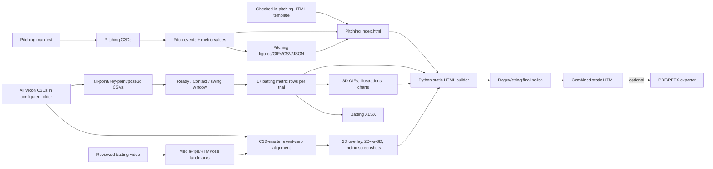
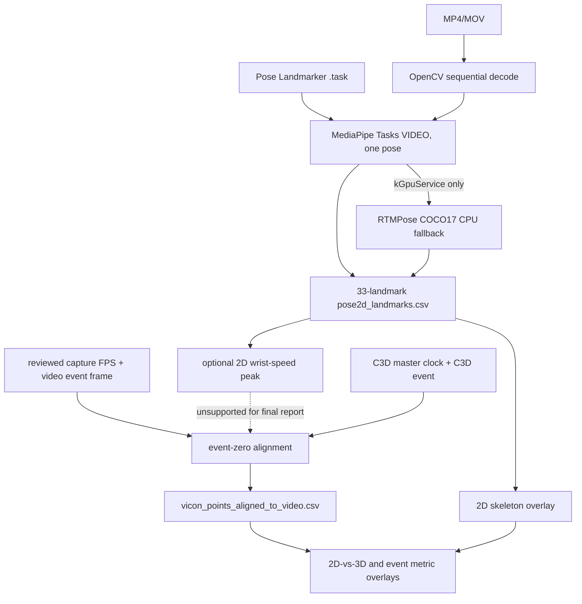
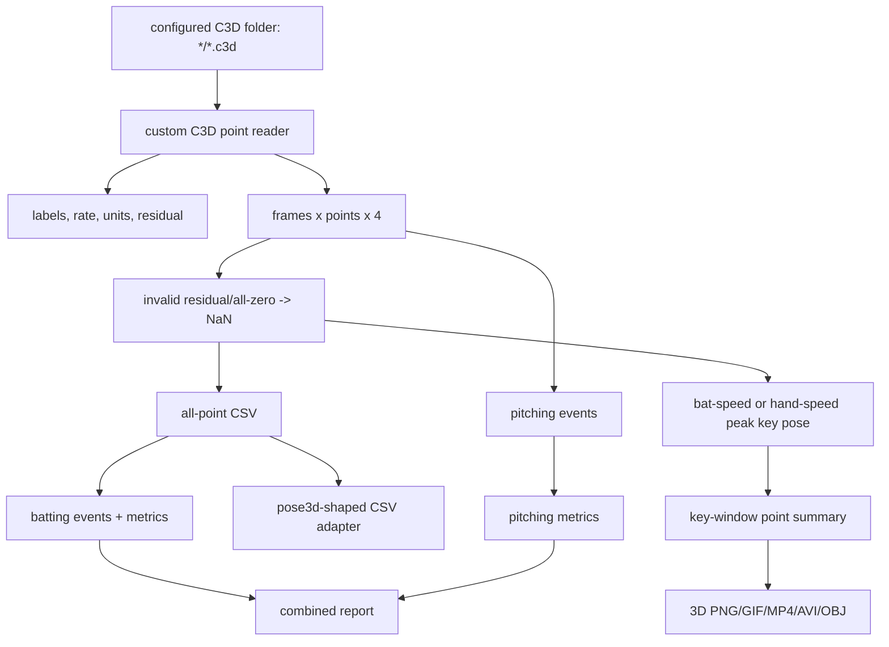
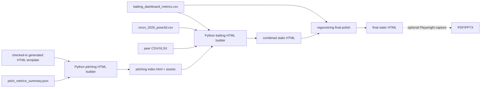

# Repository Audit

> Repository: `baseball-report-generation`
>
> Audit branch: `refactor/systematic-engineering`
>
> Audit date: 2026-07-17
> Phase: 1 — read-only engineering audit (this document is the only Phase 1 deliverable)

## 0. Scope, evidence, and confidence labels

This audit describes the repository as it exists in the working tree, not an
idealized baseball-analysis platform. The repository is primarily a
config-driven Vicon C3D report generator. It also performs MediaPipe/RTMPose
2D pose extraction for video-to-Vicon alignment and visual QA. It does **not**
contain a React, TypeScript, or application-server frontend. The report
"frontend" is static HTML/CSS assembled by Python and optionally exported by
Node.js to PDF/PPTX.

Evidence inspected:

- every tracked Python, JavaScript, JSON, Markdown, HTML, CSS-containing
  builder, test, and package/requirements file;
- every `if __name__ == "__main__"`, `argparse` parser, Node entry, subprocess
  invocation, import, dynamic import, and `sys.path` mutation;
- generated CSV/JSON/HTML artifacts under representative batting and pitching
  report directories;
- all player final configs, batting configs, and pitching manifests;
- C3D headers for every currently referenced unique trial (first/last frame,
  point count, analog sample count, rate, and point units).

No notebook, shell script, Dockerfile, Compose file, `pyproject.toml`, formal
JSON Schema, React source, or TypeScript source exists in the tracked tree.

Confidence labels used below:

- **Confirmed**: directly observed in code, config, artifact, or C3D header.
- **Inferred**: supported by calls/file flow but not explicitly declared as a
  business contract.
- **Uncertain**: cannot be established from this repository alone.
- **Developer confirmation required**: business meaning must be supplied by a
  domain owner before changing behavior.

### Working-tree boundary

The repository was already dirty before this audit. Modified files included
the Bryan pitching HTML and five report/metric scripts; three Xuanxuan configs
and `node_modules/` were untracked. Those changes were preserved, audited as
part of the current working tree, and not reset, committed, or overwritten.

## 1. Current directory structure and responsibilities

### 1.1 Top-level areas

| Area | Actual responsibility | Inputs | Outputs | Status |
|---|---|---|---|---|
| `scripts/` | All orchestration, C3D parsing, metrics, visualization, HTML building, and export helpers. There is no installable Python package. | C3D, video, CSV, JSON configs, HTML template, images | CSV, JSON, PNG/JPG/GIF/MP4/AVI/OBJ, HTML, XLSX, PDF/PPTX | production + diagnostic mixed |
| `scripts/pitching/` | Pitching-only C3D metrics/report builder, 2D alignment wrapper, sync, overlays, charts, line-art annotation, HTML contract checks. | pitching manifest, C3D, video, template HTML | pitching HTML, metrics, figures, alignment QA | production + diagnostic mixed |
| `configs/` | Final orchestration config, batting pipeline config, pitching manifests. | manually edited JSON | resolved runtime paths and reviewed event anchors | production configuration |
| `reports/` | Generated reports and, critically, the checked-in Bryan pitching report reused as the HTML template for other players. | pipeline artifacts | final/generated HTML and assets | generated output + template mixed |
| `assets/` | Checked-in generic batting and pitching line-art/illustration sources. | PNG sources | copied/annotated report assets | production static assets |
| `outputs/` | Generated batting XLSX workbooks and previews. | metric CSV | XLSX/PNG | generated output |
| `docs/` | Existing architecture, provenance, design, timing and operational notes. | code/process knowledge | Markdown | production documentation; partly stale |
| `prompts/` | Image/chart and report-generation prompt records copied into outputs. | text | provenance notes | supporting provenance |
| `tests/` | One `unittest` file for pitching player-card DOM placement. | HTML fragments | pass/fail | very limited production test |
| `skills/` | Packaged operational workflow for the Vicon coach report. | repository conventions | operator instructions | production operations |
| `node_modules/` | Local dependencies; untracked in the audited working tree. | package install/runtime bundle | imported JS modules | environment artifact |
| `_tmp/`, macOS `._*`, `__pycache__/` | Temporary/generated filesystem noise. | local runs/Finder | non-product files | debug/noise |

### 1.2 Module/file inventory

| Module or File | Current Responsibility | Inputs | Outputs | Called By | Calls | Status |
|---|---|---|---|---|---|---|
| `scripts/report_cli.py` | Only documented public report entry; resolves final config and sequences pitching before batting. | final config JSON | pitching and combined report trees | user/README | pitching builder, pitching charts, pitching 2D wrapper, pitch overlays, batting pipeline | production/public |
| `scripts/pipeline_config.py` | Resolves batting paths relative to repo/root and validates required scalar fields. | batting config JSON | `PipelineConfig` | batting pipeline, 2D aligner | JSON/path helpers | production |
| `scripts/run_batting_report_pipeline.py` | Batting stage orchestration and artifact existence checks. | batting config + optional CLI overrides + pitch HTML | combined HTML, C3D tables, assets, XLSX | `report_cli.py` | nearly every batting script and Node XLSX builder | production/internal |
| `scripts/run_vicon_c3d_pipeline.py` | C3D extraction + reconstruction subprocess wrapper. | C3D directory | generic C3D CSVs and 3D assets | batting pipeline | C3D extractor, reconstruction renderer | production/internal |
| `scripts/build_vicon_2026_metrics.py` | Custom C3D point reader; generic trial metrics; all-frame/summary/pose3d CSV conversion. | `*/*.c3d` | four CSVs | C3D wrapper; imported by five scripts | `struct`, NumPy | production/core algorithm mixed with IO |
| `scripts/build_batting_dashboard_metrics.py` | Loads all-point CSV, detects Ready/Contact, computes 17 batting metrics and wide CSV. | `vicon_2026_points_all.csv` | long/wide batting metric CSV | batting pipeline | NumPy geometry/event logic | production/core algorithm |
| `scripts/render_vicon_reconstruction_images.py` | 3D skeleton/bat rendering, key PNG/GIF/MP4/AVI, OBJ export. | key-point CSV + original C3D | reconstruction media + model manifest | C3D wrapper; imported by event/QA scripts | C3D reader and Matplotlib | production/visualization mixed with C3D access |
| `scripts/build_julian_coach_event_gifs.py` | Renders short Ready and Contact event GIFs using metric frames. | batting metric CSV + source C3D | `*_ready.gif`, `*_contact.gif` | batting pipeline | reconstruction renderer | production; legacy name |
| `scripts/build_julian_coach_annotated_speed_gifs.py` | Recalculates per-frame bat speed, attack angle, and forearm-roll proxy and draws them on 3D GIFs. | metric CSV + point summary + C3D | annotated GIF | batting pipeline | C3D/reconstruction functions | production; duplicate calculations; legacy name |
| `scripts/align_2d_video_vicon.py` | MediaPipe video inference (RTMPose fallback), C3D extraction, reviewed/automatic event-zero mapping. | video, C3D, model, reviewed FPS/frame | pose CSV, aligned Vicon CSV, summary JSON | batting pipeline; pitching 2D wrapper | MediaPipe/OpenCV + C3D extractor | production/alignment |
| `scripts/render_aligned_2d_overlay.py` | Draws 33-landmark 2D skeleton over video. | alignment summary + pose CSV + video | MP4 + optional preview | batting pipeline; pitching wrapper | OpenCV | production/visual QA |
| `scripts/render_vicon_3d_2d_alignment_comparison.py` | Side-by-side video frame and C3D reconstruction QA. | alignment summary + C3D | MP4, preview, JSON summary | batting pipeline; pitching wrapper | reconstruction renderer | production/visual QA |
| `scripts/render_vicon_geometry_metrics_on_2d.py` | Chooses visible 2D frames corresponding to Vicon Ready/Contact frames and overlays already-computed metric values/geometry. | alignment outputs + metric CSV + video | Ready/Contact PNG, hold MP4, provenance JSON | batting pipeline | OpenCV/Pillow | production/visualization; some geometry duplicated for drawing |
| `scripts/annotate_frontend_metric_illustrations.py` | Writes metric values and callouts onto generic batting illustration PNGs. | static PNGs + metric CSV | annotated PNGs + manifest JSON | batting pipeline | Pillow | production/visualization |
| `scripts/build_julian_coach_metrics_section.py` | Reads metric/peer CSV/XLSX, calculates report scores/comparisons, generates charts, imports pitching DOM/CSS/assets, and emits full static HTML. | batting CSV, pose3d CSV, peer CSV/XLSX, pitching HTML/assets | combined HTML + charts/assets | batting pipeline; dynamically imported by final polish | internal math/chart/HTML helpers | production; 2,550-line mixed-responsibility builder; legacy name |
| `scripts/apply_batting_coach_values.py` | Post-processes generated HTML with regex/string edits, recalculates statuses/markers, dynamically imports builder to regenerate charts. | combined HTML, metric/pose CSV, peers | in-place modified HTML + refreshed charts | batting pipeline | dynamic import of builder | production; second HTML builder pass |
| `scripts/build_batting_metrics_xlsx.mjs` | Converts metric CSV to a formatted three-sheet workbook and preview PNGs. | env vars + metric CSV | XLSX + sheet PNGs | batting pipeline or direct Node | `@oai/artifact-tool` | production/export; dependency not declared in `package.json` |
| `scripts/generate_vicon_kinetic_chain_flow.py` | Standalone C3D-derived kinetic-chain flow diagnostic. | all-point CSV + optional metric CSV | PNG + stdout metric summary | no repository caller found | pandas/NumPy/Pillow | diagnostic/duplicate |
| `scripts/pitching/build_pitch_template_metrics_report.py` | Custom pitching events and metrics, scoring, figures/GIFs, template DOM rewrite, static HTML and summary generation. | manifest C3Ds + checked-in template HTML/assets | pitching HTML, CSV/JSON, media | `report_cli.py` | C3D reader, recon renderer, line-art annotator | production; 1,820-line mixed-responsibility builder |
| `scripts/pitching/annotate_pitch_lineart_metrics.py` | Adds active player metric values to three generic pitching action drawings. | pitch summary JSON + PNGs | three `*_metrics.png` | pitching builder | Pillow | production/visualization |
| `scripts/pitching/generate_professional_pitch_charts.py` | Builds pitching angle/speed/kinetic-chain researcher charts from summary JSON. | pitch summary JSON | PNGs + prompt note | `report_cli.py` | Matplotlib | production/visualization; recalculates plotted series from summary values |
| `scripts/pitching/run_vicon_2d_alignment.py` | Cleans and orchestrates pitching sync, pose alignment, overlay, and 2D-vs-3D QA; writes manifest. | video, C3D, model, reviewed anchor | sync/alignment/comparison tree | `report_cli.py` | four companion scripts | production/internal |
| `scripts/pitching/sync_vicon_video.py` | Second custom C3D parser; derives bat/hand speed peak, video motion energy, correlation sanity check. | video + C3D | sync signal CSV + JSON | pitching 2D wrapper; direct diagnostic | OpenCV/NumPy | production QA; duplicate C3D/math implementation |
| `scripts/pitching/render_pitch_event_overlays.py` | Maps pitching event indices to reviewed video anchor and draws 2D skeleton/value cards. | alignment dir + pitch summary | 3 PNGs + provenance JSON | `report_cli.py` | 2D overlay loader | production/visualization |
| `scripts/pitching/player_card_contract.py` | Regex-based DOM contract check for coach reference placement in player pitching cards. | HTML fragment | validation result | both HTML builders + test | regex | production validation |
| `scripts/export_report_from_html.mjs` | Optional headless Chromium HTML capture and PDF/PPTX exporter with QA images. | static HTML + local media | PDF/PPTX + work-dir QA | npm scripts/direct Node | Playwright + artifact tool | optional production export |
| `tests/test_pitch_player_card_contract.py` | Four unit tests for one HTML-card placement invariant. | synthetic HTML | test result | developer | `sys.path` import of script | production test, narrow |

## 2. Directly executable entry points

The distinction below is important: many files are technically executable,
but only `report_cli.py` is documented as a public report contract.

| Entry Point | Purpose | Required Inputs | Generated Outputs | Dependencies | Used By |
|---|---|---|---|---|---|
| `python scripts/report_cli.py final --config ...` | full combined deliverable | final JSON and all referenced C3D/video/model/template files | pitching tree then combined batting HTML/assets/XLSX | Python + Node + sibling data/model dirs | public handoff |
| `python scripts/report_cli.py pitching --config ...` | pitching-only build/retry | final JSON | pitching HTML/assets; optional 2D QA | same | public retry |
| `python scripts/report_cli.py batting --config ...` | batting build/retry | final JSON + existing pitching HTML | combined HTML/assets/XLSX | same | public retry |
| `python scripts/run_batting_report_pipeline.py` | internal staged batting build | batting config | batting/combined report tree | all batting scripts | public CLI wrapper |
| `python scripts/run_vicon_c3d_pipeline.py` | generic C3D extraction/reconstruction | C3D directory | four CSVs + reconstruction assets | NumPy/Matplotlib/OpenCV | batting stage/debug |
| `python scripts/build_vicon_2026_metrics.py` | direct C3D-to-CSV extraction | C3D directory | metrics/points/all-points/pose3d CSV | NumPy | C3D wrapper/debug |
| `python scripts/build_batting_dashboard_metrics.py` | batting events/metrics | all-points CSV | long/wide metric CSV | NumPy | batting stage/debug |
| `python scripts/render_vicon_reconstruction_images.py` | 3D media and OBJ | C3D + point summary | PNG/GIF/MP4/AVI/OBJ/manifest | Matplotlib/OpenCV | C3D wrapper/debug |
| `python scripts/build_julian_coach_event_gifs.py` | Ready/Contact GIFs | metric CSV + C3D paths in rows | GIFs | recon module | batting stage/debug |
| `python scripts/build_julian_coach_annotated_speed_gifs.py` | metric-annotated 3D GIF | metrics + points + C3D | GIFs | recon/C3D modules | batting stage/debug |
| `python scripts/align_2d_video_vicon.py` | video pose and Vicon alignment | video + C3D + pose model | two CSVs + JSON | MediaPipe/OpenCV; optional RTMPose | batting/pitching alignment |
| `python scripts/render_aligned_2d_overlay.py` | 2D skeleton overlay | summary + pose CSV | MP4/JPG | OpenCV | alignment wrappers |
| `python scripts/render_vicon_3d_2d_alignment_comparison.py` | 2D/3D QA comparison | summary + C3D | MP4/JPG/JSON | OpenCV/Matplotlib | alignment wrappers |
| `python scripts/render_vicon_geometry_metrics_on_2d.py` | batting Vicon metrics on 2D frame | alignment + metrics | PNG/MP4/JSON | OpenCV/Pillow | batting stage |
| `python scripts/annotate_frontend_metric_illustrations.py` | static metric illustrations | metric CSV + base PNGs | PNGs + manifest | Pillow | batting stage |
| `python scripts/build_julian_coach_metrics_section.py` | combined static HTML builder | metrics/peers/pitch HTML | HTML + charts/copied assets | Pillow/CSV/XML | batting stage |
| `python scripts/apply_batting_coach_values.py` | in-place final HTML polish | HTML + metrics + pose + peers | modified HTML/charts | dynamic import | batting stage |
| `python scripts/generate_vicon_kinetic_chain_flow.py` | standalone diagnostic chart | all-point/metric CSV | PNG | pandas/Pillow | no caller found |
| `python scripts/pitching/build_pitch_template_metrics_report.py` | pitching report builder | manifest + template | HTML/CSV/JSON/media | NumPy/Matplotlib/Pillow | public pitching execution |
| `python scripts/pitching/annotate_pitch_lineart_metrics.py` | pitching line-art values | summary + images | PNGs | Pillow | pitching builder |
| `python scripts/pitching/generate_professional_pitch_charts.py` | researcher charts | summary JSON | PNGs | Matplotlib | public pitching execution |
| `python scripts/pitching/run_vicon_2d_alignment.py` | pitching 2D QA wrapper | video/C3D/model/reviewed anchor | sync/alignment/QA outputs | subprocess helpers | public pitching execution |
| `python scripts/pitching/sync_vicon_video.py` | automatic sync diagnostic | one or more video/C3D pairs | CSV + JSON | OpenCV/NumPy | pitching wrapper |
| `python scripts/pitching/render_pitch_event_overlays.py` | pitching event screenshots | alignment + summary | PNGs + JSON | OpenCV/Pillow | public pitching execution |
| `node scripts/build_batting_metrics_xlsx.mjs` | workbook export | env vars + metric CSV | XLSX + PNG previews | artifact tool | batting pipeline |
| `npm run export:report[:pdf|:pptx]` | optional HTML export | HTML and CLI args | PDF/PPTX + QA | Playwright/artifact tool | operator |
| `python -m unittest tests/test_pitch_player_card_contract.py` | narrow unit test | repository source | test status | stdlib | developer |

No supported `python -m baseball_analysis ...` package entry currently exists.

## 3. Python and process call relationships

### 3.1 Confirmed module/process graph

```mermaid
flowchart TD
    CLI["report_cli.py"] --> PitchBuilder["pitching/build_pitch_template_metrics_report.py"]
    CLI --> PitchCharts["pitching/generate_professional_pitch_charts.py"]
    CLI --> PitchAlignWrap["pitching/run_vicon_2d_alignment.py"]
    CLI --> PitchOverlay["pitching/render_pitch_event_overlays.py"]
    CLI --> BatPipeline["run_batting_report_pipeline.py"]

    PitchBuilder --> C3DCore["build_vicon_2026_metrics.py: read_c3d"]
    PitchBuilder --> Recon["render_vicon_reconstruction_images.py"]
    PitchBuilder --> PitchLineart["pitching/annotate_pitch_lineart_metrics.py"]

    PitchAlignWrap --> Sync["pitching/sync_vicon_video.py"]
    PitchAlignWrap --> Align["align_2d_video_vicon.py"]
    PitchAlignWrap --> Overlay2D["render_aligned_2d_overlay.py"]
    PitchAlignWrap --> Compare2D3D["render_vicon_3d_2d_alignment_comparison.py"]

    BatPipeline --> C3DWrap["run_vicon_c3d_pipeline.py"]
    C3DWrap --> C3DCore
    C3DWrap --> Recon
    BatPipeline --> BatMetrics["build_batting_dashboard_metrics.py"]
    BatPipeline --> EventGIF["build_julian_coach_event_gifs.py"]
    BatPipeline --> SpeedGIF["build_julian_coach_annotated_speed_gifs.py"]
    BatPipeline --> Align
    BatPipeline --> Overlay2D
    BatPipeline --> Compare2D3D
    BatPipeline --> Geometry2D["render_vicon_geometry_metrics_on_2d.py"]
    BatPipeline --> BatLineart["annotate_frontend_metric_illustrations.py"]
    BatPipeline --> HTMLBuilder["build_julian_coach_metrics_section.py"]
    BatPipeline --> Polish["apply_batting_coach_values.py"]
    BatPipeline --> XLSX["build_batting_metrics_xlsx.mjs"]

    EventGIF --> Recon
    SpeedGIF --> C3DCore
    SpeedGIF --> Recon
    Align --> C3DCore
    Compare2D3D --> Recon
    Polish -. "dynamic import" .-> HTMLBuilder
```

### 3.2 Import/path behavior

- Four production scripts mutate `sys.path` to import sibling scripts:
  `align_2d_video_vicon.py`, `render_vicon_3d_2d_alignment_comparison.py`,
  `pitching/build_pitch_template_metrics_report.py`, and
  `pitching/render_pitch_event_overlays.py`. The test does the same.
- `apply_batting_coach_values.py` dynamically loads the HTML builder from a
  file path using `importlib.util.spec_from_file_location` and mutates its
  module globals before calling chart functions.
- No circular Python import was found by static inspection, but imports depend
  on script-directory placement rather than an installable package boundary.
- Three orchestrators use subprocesses instead of function calls. This keeps
  failures stage-local but makes schemas and stage results implicit filesystem
  contracts.
- No notebook or shell-script caller was found.

### 3.3 Duplicate implementations

Confirmed duplicated or near-duplicated functions include C3D parsing,
label cleaning, missing-point averaging, speed conversion, smoothing, plane
angles, circular angle difference, CSV reading, formatting, font discovery,
and per-frame bat/forearm metrics. The duplicates do not all have identical
behavior; therefore consolidation must be protected by characterization tests.

## 4. End-to-end data flow and artifacts

### 4.1 Actual combined report flow

### 4.2 Core artifact contract

| Data Artifact | Producer | Consumer | Format / important fields | Coordinate System | Units | Validation |
|---|---|---|---|---|---|---|
| raw video | external capture | alignment/sync | MP4/MOV; OpenCV metadata | camera/image | pixels, encoded FPS; reviewed capture FPS | openable only; no camera calibration |
| raw C3D | Vicon external | two custom readers | binary points + labels/header | Vicon global; axis convention not declared in repo | header says `mm` for all audited samples | minimal header/shape checks |
| `vicon_2026_metrics.csv` | generic C3D extractor | no final metric consumer found | one row/trial generic summary | Vicon global | mixed deg/km/h/sec/% | no schema |
| `vicon_2026_point_summary.csv` | generic extractor | 3D reconstruction/event GIFs | key event window-average point rows | Vicon global | explicit `*_mm`, sec, array index | header only |
| `vicon_2026_points_all.csv` | generic extractor | batting metrics, kinetic chart | one point/frame row; `frame_index`, `timestamp_sec`, XYZ, residual, valid | Vicon global | columns hard-code mm; `units` also stored | no unit assertion; no formal schema |
| `vicon_2026_pose3d.csv` | generic extractor | HTML builder charts | `clip_id`, `frame_index`, `joint_name`, `x_3d...` | Vicon global although named pose3d | mm via `scale_mode` string | no schema |
| `batting_dashboard_metrics.csv` | batting metric builder | HTML, XLSX, figures, overlays | long rows with key/value/unit/event/formula/points/components | metric-specific; mostly Vicon XY/Z | mixed; explicit string per row | consumers assume exact keys |
| batting wide CSV | batting metric builder | no direct final consumer found | one row/trial, metric keys as columns | derived | mixed without per-cell unit | none |
| `pitch_metrics_summary.json` | pitching builder | charts, overlays, line art, report | assumptions + athlete metadata/events/values | Vicon global + Vicon angle channels | mixed, encoded only in key names/registry | no formal schema |
| `pitch_metrics_all_players.csv` | pitching builder | audit/operator output; HTML already has values in memory | selected 18 rows/athlete | derived | `deg`, `pct`, `cm`, `kmh` | no schema |
| `pose2d_landmarks.csv` | pose aligner | overlay and event screenshots | 33 landmarks/frame; norm, px, visibility, presence | MediaPipe image coordinates | normalized and pixels | required file only |
| aligned Vicon CSV | pose aligner | 2D-vs-3D/geometry renderers | all C3D points plus aligned video frame/time | Vicon global + explicit video mapping | mm/sec/frame indices | summary source path check in batting wrapper |
| alignment summary JSON | pose aligner | all 2D QA renderers | video/C3D metadata, two anchor events, mapping | mixed but fields separated | seconds/FPS/indices | required file and source identity checks |
| image/video/OBJ assets | renderers | static HTML/export | PNG/JPG/GIF/MP4/AVI/OBJ | screen or Vicon 3D render | visual | mostly existence checks |
| pitching HTML | pitching builder | combined HTML builder | static DOM/CSS with local asset paths | screen | display units embedded in text | regex DOM-count contract |
| combined HTML | batting builder + polish | browser/exporter | complete static HTML/CSS; no formal props/schema | screen | formatted strings | pitching-card regex contract only |
| XLSX | Node workbook builder | operator/delivery | three sheets + previews | tabular | converted display units | artifact-tool formula error scan |
| PDF/PPTX | optional exporter | delivery | captured HTML slices | page/slide | display only | screenshot/QA files, no semantic assertion |

### 4.3 Frame identity

Three different frame identities are currently present:

1. **C3D array index**: zero-based index after loading. This is what almost all
   metric/event code calls `frame_index`.
2. **Original C3D frame number**: header `first_frame + array_index`. The main
   C3D reader does not retain `first_frame`.
3. **Video frame index**: encoded source index, interpreted using both playback
   FPS and reviewed capture FPS.

The distinction is not preserved consistently. For example, the XLSX builder
labels `event_frame + 1` as “C3D frame number.” Header inspection proves that
this is wrong for several active files: Bryan pitching starts at 690,
Xuanxuan pitching at 677, Branden batting at 864, James batting at 949, and
Youyou batting at 458. Existing event sampling uses array indices; changing
those values without a baseline would alter reports, so this audit only flags
the semantic defect.

## 5. MediaPipe / 2D pose pipeline

### 5.1 Confirmed behavior

- OpenCV reads every video frame unless `--frame-indices` is supplied.
- MediaPipe Tasks Pose Landmarker runs in `VIDEO` mode with one pose, CPU
  delegate requested, detection/presence thresholds 0.45 and tracking 0.55.
- The model path is external, normally
  `../baseball-analysis/models/pose_landmarker_heavy.task`.
- All 33 MediaPipe pose landmarks are written. Stored values are image-space
  `x_norm`, `y_norm`, MediaPipe relative `z_norm`, pixel X/Y, visibility and
  presence. `pose_world_landmarks` are not read; there is no 3D MediaPipe
  skeleton in the current pipeline.
- There is no pose smoothing or missing-landmark interpolation in the
  MediaPipe extractor. Missing detections become blank CSV cells.
- Person selection is simply `num_poses=1`; no explicit athlete tracking or
  multi-person selection rule exists.
- There is no scale normalization, camera calibration, triangulation, image
  axis conversion, or joint-angle calculation from 2D landmarks.
- If MediaPipe creation fails specifically with `kGpuService`, RTMPose COCO17
  runs on CPU. Multiple MediaPipe landmarks map to the same COCO point (eyes,
  wrists/fingers, ankles/feet), `z_norm` is blank, and confidence is copied to
  visibility/presence. This preserves CSV shape, not landmark semantics.
- Automatic video event inference uses the peak of max(left/right wrist pixel
  speed), but the supported report pipeline requires a manually reviewed
  `video_event_frame` and `video_capture_fps`.
- MediaPipe/RTMPose results are used only for overlays and visual frame
  selection. Displayed biomechanics metrics remain C3D-derived.

### 5.2 Data flow

### 5.3 Uncertain or absent

- Camera orientation and whether videos are mirrored are not declared.
- `z_norm` sign/scale is not documented and is not consumed downstream.
- No quality threshold prevents a low-visibility pose CSV from reaching later
  stages; geometry rendering may choose a nearby visible fallback frame.
- The RTMPose fallback dependency (`rtmlib`, `onnxruntime`) is not declared in
  `requirements.txt`.

## 6. C3D / Vicon / mocap pipeline

### 6.1 Reader and point handling

- `build_vicon_2026_metrics.py` implements a binary C3D reader with `struct`
  and NumPy. It reads point labels, units, rate, residual and point XYZ. It
  supports negative-scale floating point and positive-scale integer points.
- Missing points are those with negative residual or all-zero XYZ and become
  NaN. Marker access averages whichever requested marker names exist; if none
  exist, it returns an all-NaN trajectory. No warning records which aliases
  were missing.
- No gap filling is performed in the main metric path. Some downstream
  visualization/diagnostic paths interpolate or fill NaN independently.
- Analog channels, force plates and C3D event parameters are not read. All
  audited active files have zero analog measurements per point frame, so this
  omission does not corrupt the current sample set; it remains an unsupported
  input class.
- `pitching/sync_vicon_video.py` contains a second binary reader. It supports
  only floating-point point storage, keeps `first_frame`, does not read units,
  and fills missing trajectories by interpolation for sync signals.
- Joint centers/segments are not formally reconstructed. Most “centers” are
  arithmetic means of marker pairs/groups (wrist, hip, shoulder, head, trunk,
  foot). The renderer connects marker names into a visual body model.
- Vicon-exported channels such as `LKneeAngles`, `RShoulderAngles`, and
  `RWristAngles` are accessed directly by label and fixed component index in
  pitching metrics. Their Euler/cardinal sequence is not validated or
  documented locally.
- Action type in the generic extractor is inferred only from whether `"bat"`
  appears in the filename; everything else becomes pitching.

### 6.2 Coordinate and side conventions

- Code treats C3D X/Y as the horizontal plane and Z as vertical.
- Position variables and formulas assume millimetres even though the reader
  merely records the C3D `POINT:UNITS` string. All audited active C3Ds report
  `mm`, but no runtime assertion prevents other units.
- Batting is explicitly hard-coded as right-handed: rear=R, front=L.
- Pitching is explicitly hard-coded as throwing arm=R, lead leg=L, drive leg=R.
- No global-to-local segment transformation is performed for report metrics.
- Vicon lab axis direction, target direction, and signed rotation convention
  are not declared. Batting opening angles take absolute wrapped differences
  to suppress direction sign; raw signed values are stored only in component
  JSON for two metrics.

### 6.3 C3D data flow

## 7. Motion events and phases

The repository does not implement a full named phase model. It implements
event anchors/windows that report sections call phases.

| Event | Detection Logic | Source Data | Threshold / Rule | Used Metrics / Assets | Confidence |
|---|---|---|---|---|---|
| batting swing segment | smooth Bat1 speed (radius 2); find global peak; contiguous frames above `max(8 km/h, 20% peak)`; expand 0.15 s both sides | C3D Bat1 | fixed thresholds | Ready search, Contact candidates, high-speed zone, GIF window | heuristic; no confidence field |
| Ready Position | before swing start within 0.68 s (and optional valid-start index), choose highest valid five-frame block with all frames below `max(6 km/h, 12% peak)`; fallback to first valid frames | C3D Bat1/Bat5/head + Bat1 speed | defaults above; count=5 | 6 Ready metrics + 3 coach flags + event GIF | heuristic; config-sensitive |
| Contact Position | five lowest Bat1 Z frames inside expanded swing segment; fallback to all frames if empty | C3D Bat1 | count=5; **not actual ball contact** | 5 Contact metrics, head displacement, rollover, GIF | explicitly proxy; medium/uncertain biomechanical event |
| High-Speed Hitting Zone | frames within swing segment with Bat1 speed >= 90% of peak | C3D Bat1 | 90% | stability score | heuristic |
| generic batting key pose | Bat1 peak speed | C3D Bat1/Bat5 | global max | point summary/reconstruction/alignment Vicon anchor | deterministic proxy |
| generic pitching key pose | faster wrist side peak speed, else midpoint | C3D wrist markers | global max | generic reconstruction/alignment Vicon anchor | deterministic proxy; may differ from pitching release below |
| peak knee | smoothed left-knee Z global maximum | C3D LKNE | radius=2 | pitching preparation metrics/assets | heuristic |
| foot contact | first frame > peak+10 where averaged LHEE/LTOE Z <= estimated floor+70 mm; fallback peak+1 s | C3D foot markers | 70 mm, 10 frames | stored event; knee change contact-to-release | heuristic |
| foot plant | fourth stable candidate after contact with foot speed <=0.75 m/s within 0.28 s; fallback contact+0.14 s | C3D foot markers | 0.75 m/s, windows above | most landing metrics/assets | heuristic |
| pitching release | peak smoothed right-hand proxy speed from plant through +0.55 s; fallback plant+0.2 s | RWRA/RWRB/RFIN | fixed search window | release metrics/assets | proxy, not ball release |
| video batting/pitch anchor (supported) | manually reviewed frame from config | raw video | required final-pipeline config | all 2D alignment assets | human-reviewed; confidence not encoded |
| video event (automatic utility) | max left/right wrist pixel speed | 2D landmarks | global max | optional aligner use only | unsupported for report publication |
| sync video anchor | peak image motion energy; correlation used only as sanity check | grayscale video | 85th-percentile active pixels | sync JSON | high/medium string or hidden video error |
| sync C3D batting/pitching anchor | fastest bat-marker or hand-marker speed peak | second C3D parser | 98th percentile chooses marker; global max chooses frame | sync JSON | diagnostic |

### Event inconsistencies

- “Release” has at least two C3D definitions: generic fastest wrist peak and
  pitching-builder right-hand peak constrained after foot plant.
- “Contact” in the batting report is lowest Bat1 Z, while the generic
  reconstruction/alignment anchor is Bat1 speed peak. They are different
  events by design but are not represented by a shared event type.
- Events are dictionaries/CSV strings with different names and fields. There
  is no `MotionEvent` model, confidence standard, or canonical event registry.
- Every event index is a zero-based loaded-array position. Original C3D frame
  numbers are unavailable in the main path.

## 8. Metrics inventory

### 8.1 Final batting metrics (17)

The CSV itself has no English-name field; the English names below are the
confirmed `BACKEND_EN` labels used by the HTML builder.

| Metric ID | Chinese / English | Formula (current implementation) | Required points | Event | Unit | Implementation | Report usage |
|---|---|---|---|---|---|---|---|
| `ready_com_height_ratio` | 重心高度 / Ready Body Height | mean(COM Z)/height proxy; COM marker else `0.6*hip_mid+0.4*trunk_mid` | COM or pelvis/trunk + head/feet | Ready | height ratio | batting metric builder | backend card; front “平衡” score |
| `ready_rear_hip_flexion_deg` | 后髋屈曲角 / Rear Hip Load | `180-angle(shoulder_mid,R hip,R knee)` | shoulders, R pelvis, RKNE | Ready | deg | same | backend + lower-load score |
| `ready_rear_knee_flexion_deg` | 后膝屈曲角 / Rear Knee Load | `180-angle(R hip,R knee,R ankle/heel/toe)` | R pelvis/knee/foot | Ready | deg | same | backend + lower-load score |
| `ready_hip_shoulder_separation_deg` | 髋肩分离角 / Hip-shoulder Separation Angle | abs wrapped shoulder-line minus pelvis-line XY angle | pelvis + shoulders | Ready | deg | same | torso-load score/card |
| `ready_bat_tilt_deg` | 球棒倾角 / Bat Angle at Ready | `atan2(abs(Bat axis Z), norm(Bat axis XY))` | Bat1, Bat5 | Ready | deg | same | bat-ready score/card |
| `ready_hand_height_ratio` | 握棒手高度 / Hand Height | mean bilateral wrist-center Z / height proxy | wrists + head/feet | Ready | height ratio | same | bat-ready score/card |
| `contact_bat_speed_kmh` | 球棒速度 / Bat Speed | mean `norm(diff(Bat1)/dt)*3.6/1000` | Bat1 | Contact | km/h | same | report/XLSX/charts/status |
| `contact_attack_angle_deg` | 挥棒路径角 / Attack Angle | `atan2(Bat1 velocity Z, norm(velocity XY))` | Bat1 | Contact | deg | same | report/XLSX/overlay |
| `contact_pelvis_rotation_open_deg` | 骨盆旋转角 / Pelvis Rotation | abs wrapped pelvis XY angle minus Ready baseline | pelvis | Contact | deg | same | report/overlay |
| `contact_torso_rotation_open_deg` | 躯干旋转角 / Torso Rotation | abs wrapped shoulder XY angle minus Ready baseline | shoulders | Contact | deg | same | report/overlay |
| `contact_front_knee_flexion_deg` | 前膝屈曲角 / Front Knee Support | `180-angle(L hip,L knee,L ankle/heel/toe)` | L pelvis/knee/foot | Contact | deg | same | report/overlay |
| `ready_to_contact_head_displacement_mm` | 头部位移 / Head Stability | norm(Contact mean head - Ready mean head) | four head markers | Ready→Contact | mm | same | report and stability front score |
| `coach_high_com_risk_index` | 重心偏高指数 / High Center of Mass | 100×mean of clipped COM-height, rear-hip, rear-knee heuristic components | COM/derived + flexion metrics | Ready | 0–100 risk | same | issue card |
| `coach_rear_elbow_height_diff_mm` | 后肘高度差（掉肘） / Dropped Rear Elbow | mean(RELB Z - RSHO Z) | RELB, RSHO | Ready | mm | same | issue card |
| `coach_bat_loading_angle_to_catcher_deg` | 球棒加载角 / Bat Load | angle of Ready Bat5→Bat1 XY against negative Contact Bat1 velocity XY | Bat1, Bat5 | Ready + Contact | deg | same | issue card |
| `coach_rollover_forearm_roll_velocity_deg_s` | 手腕翻转角速度 / Early Wrist Roll | max abs derivative of signed wrist radial angle about elbow→wrist axis | RELB, RWRA, RWRB | Contact | deg/s | same | issue card |
| `coach_hitting_zone_stability_score` | 击球区稳定性 / Hitting Zone Stability | 100×mean(path length/650, `1-attack std/18`, `1-curvature/0.006`, clipped) | Bat1 | >=90% peak zone | 0–100 score | same | backend/research usage; omitted from XLSX `ORDER` |

All batting side-specific formulas assume a right-handed batter. No metric row
contains handedness, front/rear side, coordinate-system identifier, quality,
warning, or unavailable status.

### 8.2 Final pitching metric registry (18)

| Metric ID | Chinese / English | Formula / source | Required points/channel | Event | Unit | Report usage |
|---|---|---|---|---|---|---|
| `knee_height_pct` | 抬腿高度 / Knee Lift Height | `(LKNE_Z-floor)/height*100` | LKNE + floor/head proxies | peak knee | % height | card/line art |
| `front_knee_peak_deg` | 前腿收紧 / Lead-Knee Tuck | component 0 of `LKneeAngles` | Vicon angle channel | peak knee | deg | card |
| `rear_knee_peak_deg` | 后腿蓄力 / Rear-Leg Load | component 0 of `RKneeAngles` | Vicon angle channel | peak knee | deg | card |
| `stride_distance_pct` | 跨步距离 / Stride Distance | XY norm(L heel at plant − R foot at peak)/height×100 | heels/toes | foot plant | % height | card |
| `stride_direction_deg` | 跨步方向 / Stride Direction | atan2 of same stride XY vector | heels/toes | foot plant | deg | card |
| `front_knee_plant_deg` | 前膝屈曲 / Lead-Knee Flexion | `LKneeAngles[0]` | channel | foot plant | deg | card |
| `rear_knee_plant_deg` | 后膝屈曲 / Rear-Knee Flexion | `RKneeAngles[0]` | channel | foot plant | deg | card |
| `elbow_vs_shoulder_cm` | 投球肘相对肩线 / Throwing-Elbow Height | `(RELB_Z-RSHO_Z)/10` | RELB, RSHO | foot plant | cm | card |
| `shoulder_abduction_plant_deg` | 肩外展 / Shoulder Abduction | `RShoulderAngles[1]` | channel | foot plant | deg | card |
| `front_knee_release_deg` | 出手前膝角 / Release Lead-Knee Angle | `LKneeAngles[0]` | channel | release | deg | card |
| `front_knee_change_plant_to_release_deg` | 落地到出手前膝变化 / Lead-Knee Change: Plant to Release | release minus plant channel value | `LKneeAngles[0]` | plant→release | deg | card |
| `shoulder_abduction_release_deg` | 出手肩外展 / Release Shoulder Abduction | `RShoulderAngles[1]` | channel | release | deg | card |
| `elbow_flex_release_deg` | 出手肘屈曲 / Release Elbow Flexion | `RElbowAngles[0]` | channel | release | deg | card |
| `arm_slot_deg` | 出手手臂角度 / Release Arm Angle | atan2(R wrist−elbow Z, horizontal norm) | RELB, RWRA/RWRB | release | deg | card/overlay |
| `release_height_pct` | 出手高度 / Release Height | `(RFIN_Z-floor)/height*100` | RFIN + body height proxies | release | % height | card/overlay |
| `hand_speed_kmh` | 出手手速 / Release Hand Speed | smoothed speed of mean(R wrist,RFIN) at release ×3.6 | RWRA/RWRB/RFIN | release | km/h | card/charts; explicitly not ball speed |
| `max_hss_deg` | 最大髋肩分离 / Maximum Hip-Shoulder Separation | max abs wrapped shoulder-line/pelvis-line XY difference from peak knee to release | shoulders/pelvis | phase window | deg | issue card |
| `hss_release_amount_deg` | 髋肩分离释放量 / Hip-Shoulder Separation Release | max HSS − HSS at release | same | max→release | deg | issue card |

The pitching builder also computes 20+ auxiliary values (floor/height in mm,
hip/ankle/wrist/shoulder channels, foot-contact changes, rear-knee drive
extension, release lateral/forward position, HSS at named events, and event
times). Some appear in issue cards, movement media, charts, or JSON but are not
members of the selected 18-row CSV registry. Consequently there is no single
complete pitching metric registry.

### 8.3 Generic and visualization-only metrics

- `build_vicon_2026_metrics.py` separately computes generic trial summaries:
  95th-percentile hip-shoulder separation, median lead-knee/elbow angles,
  95th-percentile trunk tilt, peak hand/trunk/hip/bat speed, active swing time,
  and median bat angle. The final batting/pitching builders do not consume
  these values; formulas overlap but are not identical to report metrics.
- `generate_vicon_kinetic_chain_flow.py` computes pelvis/trunk angular velocity
  and shoulder/elbow/hand linear-speed 95th-percentile peaks. The HTML builder
  contains its own batting time-series/kinetic-chain computation rather than
  calling this utility.
- The annotated speed GIF recalculates bat speed, attack angle and forearm roll
  instead of reading a shared time-series metric artifact.

## 9. Visualization and chart flow

| Visualization | Input Data | Generator | Output | Used In | Duplicated Logic |
|---|---|---|---|---|---|
| Vicon 3D skeleton/key pose | C3D + key summary | reconstruction renderer | PNG | report/assets | marker maps embedded in renderer |
| action animations | C3D + event rows | reconstruction renderer/event helpers | GIF/MP4/AVI | report | event windows passed as ad-hoc rows |
| OBJ key pose | key summary | reconstruction renderer | OBJ + CSV manifest | artifact/debug | no schema |
| annotated 3D bat GIF | C3D | annotated-speed GIF script | GIF | batting report | bat/roll formulas duplicated |
| MediaPipe skeleton overlay | pose CSV + video | aligned overlay renderer | MP4/JPG | QA | landmark connections hard-coded |
| 2D vs Vicon 3D | alignment JSON + C3D/video | comparison renderer | MP4/JPG/JSON | QA | imports renderer using `sys.path` |
| batting Vicon metric overlays | metrics + aligned pose/video | geometry-on-2D renderer | PNG/MP4/JSON | report/QA | drawing geometry recomputed separately |
| pitching event overlays | pitch summary + aligned pose/video | pitch overlay renderer | three PNGs + JSON | pitching report assets | event mapping separately implemented |
| generic batting metric illustrations | static PNG + metrics | illustration annotator | 14 annotated PNGs + manifest | report | value-name mapping hard-coded |
| pitching line-art | static PNG + summary | pitching line-art annotator | three PNGs | pitching report | metric lookup hard-coded |
| batting speed/angle curves | pose3d + metrics | HTML builder | PNG | researcher section | time-series formulas inside builder |
| batting kinetic-chain flow/curve | pose3d + metrics | HTML builder | PNG | researcher section | overlaps standalone kinetic utility |
| pitching angle/speed curves | pitch summary | professional chart script | PNG | researcher section | chart series derived from summary arrays |
| pitching kinetic chain | C3D/summary inside pitching builder + chart script | pitching builder/chart script | PNG/GIF | report | generation split across two scripts |
| peer bars/cards/dashboard | metric rows + peer rows | Python HTML builders | HTML/CSS | final report | scores/status thresholds in presentation layer |
| XLSX sheet previews | metric CSV | Node workbook builder | PNG | QA | metric order/names duplicated in JS |
| PDF/PPTX page/slide captures | final HTML | Node exporter | PDF/PPTX + images | delivery | DOM selector contract implicit |

Visualizations mostly consume metric rows, but several recalculate numerical
series. There is no `ChartArtifact` model or chart-ready JSON contract.

## 10. Report builder and “frontend” flow

### 10.1 Confirmed architecture

- There is no React/TS frontend or development server command.
- Pitching HTML is first built from a checked-in generated Bryan report used as
  a DOM/CSS template. Python regex/string functions rebind values, names,
  images, comparisons, and copy.
- The batting builder generates a complete HTML document, reads peer data from
  either metric CSVs or XLSX files, calculates composite scores/statuses,
  generates researcher images, parses selected pitching sections from pitching
  HTML, scopes pitching CSS, copies pitching assets to `pitch_assets/`, and
  embeds the sections.
- `apply_batting_coach_values.py` then reads the HTML back, dynamically imports
  the first builder, optionally regenerates assets, and performs a second set
  of regex/string modifications in place.
- HTML consumers receive no JSON `ReportData`. Their real contract is the
  metric CSV column names, exact metric IDs, exact section headings, CSS class
  names, exact DOM ordering, and local asset paths.
- The static HTML does not calculate joint angles or speeds in browser-side
  JavaScript. However, reporting-layer Python calculates scores, peer ranges,
  chart time series, and some metric proxies, so analysis and presentation are
  still mixed.
- Missing data often becomes `暂无`, `N/A`, or empty ranges at formatting time,
  but many earlier lookups require exact rows/keys and can raise `KeyError`,
  `StopIteration`, or file errors. There is no uniform missing-data state.
- Chinese/English names and narrative text are embedded in Python dictionaries
  and string literals. Some player-specific copy is corrected by later string
  replacement.
- Final output is static HTML. PDF/PPTX are separate optional exports; neither
  is invoked by the main report CLI.

### 10.2 Actual contract graph

### 10.3 Multiple builder/schema behavior

There are two sport builders plus a batting post-processor. Pitching JSON and
batting CSV use unrelated schemas. The combined builder does not read a shared
analysis-result object. Metric names, scoring thresholds, asset paths and DOM
contracts are duplicated across Python, JavaScript/XLSX, checked-in HTML and
documentation.

## 11. Problems and priorities

Priority means risk, not permission to change behavior. P0/P1 items require a
baseline and domain confirmation before correction.

### P0 — may produce wrong metric/report meaning

| Problem | Evidence | Impact |
|---|---|---|
| Original C3D frame offset is discarded | main reader omits `first_frame`; several active C3Ds start at 458–949; XLSX labels index+1 as C3D frame | reported event frame identity can be wrong even when sampled array position/value is unchanged; cross-system traceability is unsafe |
| Side/handedness is hard-coded | batting `choose_batting_side()` always R rear/L front; pitching summary explicitly L lead/R drive/R arm | any left-handed batter/pitcher would use wrong limbs and potentially wrong event/metric values |
| Coordinate and unit assumptions are unvalidated | all distance/speed formulas assume mm, XY horizontal, Z vertical; pitching reads fixed Vicon angle-channel components | another Vicon export convention can silently change physical meaning |
| Contact is a proxy but appears as Contact Position | code and metric documentation define it as lowest Bat1 Z in the swing window; no ball marker exists; report prose uses contact terminology | this is the confirmed legacy report contract, but readers may still interpret the proxy as verified bat-ball contact; wording/value changes require a separate reviewed change |

### P1 — reliability and main-pipeline maintenance

| Problem | Evidence | Impact |
|---|---|---|
| Two non-equivalent C3D readers | one supports integer/float and loses first frame; sync reader keeps first frame but rejects integer storage | fixes and label/missing-data rules can diverge; same file has two interpretations |
| No stable analysis/report schema | CSV rows, summary JSON, exact HTML DOM/classes and paths are the contract | upstream changes can break builder/export without type/schema validation |
| Metric/event logic is duplicated | generic metrics, final metrics, annotated GIF and kinetic chart recalculate related formulas | “same” value/curve may drift by smoothing, aggregation or window choice |
| Analysis, visualization and reporting are mixed | both 1,800–2,550 line builders calculate metrics/scores/charts and rewrite HTML | difficult impact analysis and characterization |
| Canonical template and Bryan output share one path | `reports/pitching_bryan_coach/index.html` is the only Git-tracked `index.html`; README/configs use `reports/pitching_bryan_coach` as the pitching template, while Bryan generation can write to the same tree | the authoritative source is known, but baseline capture and regeneration must protect it from accidental in-place contamination |
| Output directories are destructively rebuilt | pitching builder removes output tree unless reuse flag; batting clears selected 2D trees | safe only when config target is correct; no dry-run/overwrite contract |
| Dependency contract is incomplete | `@oai/artifact-tool`, `rtmlib`, and `onnxruntime` imports are not declared; runtime relies on sibling repo venv/models/data | fresh checkout is not independently reproducible |
| Missing marker/metric behavior has no warnings model | marker aliases silently average available points or return NaN; consumers often require rows | report may degrade or crash without a traceable quality state |
| Sync catches all video errors | sync stores error text in confidence and continues C3D-only | wrapper can produce required files despite failed video sync; QA meaning is ambiguous |
| Entire C3D folder is processed for each batting report | configured `../vicon_2026` glob loads every `*/*.c3d` | unrelated athletes/actions affect runtime, assets, peer rows and artifact counts |

### P2 — architecture and extensibility

- No package/module boundary; production imports require `sys.path` edits.
- All orchestration stages communicate by paths and subprocess exit status;
  there is no typed stage result, warnings list, timing, or artifact manifest.
- Config is split between final JSON, batting JSON, pitching manifest, module
  constants, environment variables and hard-coded dictionaries.
- Point/marker/landmark mappings are spread across metric, alignment,
  reconstruction and overlay scripts.
- Event names and result shapes differ across batting, pitching, generic
  reconstruction, sync and video alignment.
- There is no metric registry spanning IDs, bilingual names, formulas, events,
  sides, points, units, quality and report locations.
- Comparison/scoring/reference rules live in builders, not a comparison layer.
- HTML composition depends on regex parsing instead of an explicit template or
  report-section model.
- Asset provenance is recorded inconsistently; some JSONs contain absolute
  paths, while HTML relies on relative copies and mtime query strings.
- Filename/action inference (`"bat"` else pitching) is an implicit rule.
- The optional export tool defaults to `report.html`, while normal outputs use
  player-specific filenames; it is not integrated into the public CLI.
- No formal deprecation map exists for “Julian”-named scripts that now serve
  arbitrary players.

### P3 — code quality and developer experience

- Large functions/files, extensive globals, repeated formatting/font helpers,
  and string-heavy HTML make local reasoning difficult.
- `print()` is the only operational logging; no stage duration or structured
  warning/error context exists.
- CLI layers and lower-level code sometimes raise `SystemExit` directly.
- Type hints are partial; data dictionaries are mostly `dict[str, object]` or
  untyped CSV rows.
- Requirements have no versions; no lockfile is tracked.
- No lint/type/format configuration is present.
- macOS resource forks and `__pycache__` files exist locally and complicate
  naive file discovery.
- Existing docs contain stale statements (for example older Julian-specific
  limitations and old path examples) alongside newer generalized behavior.
- Configs repeat the full peer roster and path strings for every athlete.

## 12. Testing and validation inventory

### Existing automated coverage

- Four unit tests cover only the placement/count of pitching coach-reference
  boxes inside metric-card HTML.
- The main CLI checks selected required file existence after stages.
- Batting alignment checks that summary video/C3D paths match config.
- Pitching template code checks counts of some DOM elements and stale names.
- XLSX generation scans the workbook for common formula error strings.
- No automated test covers C3D parsing, first-frame offsets, marker labels,
  units, event frames, metric values, report schemas, chart data, HTML section
  order, full CLI smoke behavior, or numerical equivalence.

### Sample-data availability

No C3D or video sample is tracked inside this repository. Active configs point
to the sibling `../vicon_2026` data directory and sibling
`../baseball-analysis/models` directory. Generated report artifacts can serve
as characterization fixtures only after deciding what can safely be checked
in and how personally identifying paths/data should be handled.

## 13. Confirmed facts, inferences, and open questions

### Confirmed facts

- Public orchestration is `report_cli.py pitching|batting|final`.
- Final execution builds pitching first and requires its HTML before batting.
- Displayed biomechanics values are C3D-derived; 2D pose is visual/alignment
  support only.
- Current referenced C3Ds are 100 Hz and declare point units `mm`; their point
  counts vary from 44 to 196 and several start at a non-1 frame.
- Active C3Ds have zero analog measurements per point frame.
- Current batting and pitching formulas assume right-handed/right-throwing
  subjects.
- The currently supported handedness profile is therefore right batting and
  right throwing: batting maps rear/front to R/L, and pitching maps throwing
  arm/drive leg/lead leg to R/R/L. Left-handed support is not implemented.
- Current production calculations use the legacy Vicon profile `mm` with XY
  treated as horizontal and Z as vertical. This describes existing behavior,
  not a claim that arbitrary Vicon exports share the same laboratory axes.
- Batting `Contact Position` is intentionally the existing lowest-`Bat1_Z`
  proxy inside the detected swing segment; it is not a measured bat-ball
  contact and is not the bat-speed peak.
- Pitching group mean/range calculations include every `role=student` row,
  including the report subject. README requires the subject first, all
  available same-group students, and exactly one coach.
- `reports/pitching_bryan_coach/index.html` is the authoritative template path:
  it is the repository's only tracked `index.html`, and all checked-in active
  final configs point `pitching.template_dir` to its parent directory.
- HTML is the primary report deliverable. PDF and PPTX are optional
  post-generation exports from the same HTML.
- RTMPose is a detector-only fallback for the specific MediaPipe GPU-service
  initialization failure. It keeps the landmark CSV transport shape and is
  used for alignment/visual overlays, not as evidence of full 33-landmark
  semantic equivalence.
- There is no shared Python/TypeScript report schema and no TS frontend.
- Final combined report generation is a two-pass Python HTML build.

### Inferred from calls/artifacts

- `vicon_2026_metrics.csv` and wide batting CSV are primarily diagnostic or
  operator artifacts because no final-report consumer was found.
- Peer comparison data is intended to represent all same-group students plus
  one coach, but enforcement differs between pitching and batting.
- Some legacy Julian names remain for historical reasons rather than current
  subject restrictions.

### Resolved from repository contracts

| Topic | Repository-backed decision for refactoring |
|---|---|
| Frame identity | Existing calculations/events use zero-based loaded-array indices. `video_event_frame` is a reviewed source-video frame. Original C3D header frame is a distinct identity that the main reader currently drops. The XLSX `index + 1` “C3D frame” label is a traceability defect, not evidence that source frames start at one. Add all identities without changing current calculations or displayed values. |
| Handedness | Validate and label the current right-batting/right-throwing profile. Do not claim left-handed support or mirror data during structural refactoring. |
| Coordinate/unit profile | Preserve `legacy_vicon_z_up_mm`: millimetres, XY horizontal calculations, Z vertical calculations. Do not generalize or convert axes without capture-specific evidence. |
| Vicon angle channels | Preserve the exact implemented mapping (`LKneeAngles[0]`, `RKneeAngles[0]`, `RAnkleAngles[0]`, `LHipAngles[0]`, `RShoulderAngles[1:2]`, `RElbowAngles[0]`, `RWristAngles[0]`) as a versioned legacy mapping. |
| Batting Contact | Preserve the lowest-`Bat1_Z` proxy, current event window, ID, value and report name. Add provenance/quality metadata in the new schema; any user-facing relabel is a separate content change. |
| Metric scope | The 17 batting final metrics and 18 pitching registry metrics are report-contract metrics. Auxiliary values are contractual when consumed by cards, charts, assets or summaries. Generic/wide exports without a final consumer remain diagnostic artifacts. |
| Authoritative template | Use the latest Git-tracked `reports/pitching_bryan_coach/index.html`. The path is authoritative even while it also serves as a generated Bryan report; baseline it and protect it from overwrite during tests. |
| Peer membership | Preserve the configured student set, including the subject, for pitching group mean/range. Batting continues to use the configured/all-player workbook membership until a separate benchmark-definition change is approved. |
| Regression tolerance | Require exact event indices, names, units, counts and rounded report strings. Compare unchanged floating calculations with a tight per-metric tolerance (initial absolute tolerance `1e-9`, relaxed only with recorded numerical evidence); use DOM and perceptual checks for rendered artifacts. |
| Fixture policy | Keep raw personal C3D/video outside Git for opt-in integration tests. Commit only synthetic/small non-identifying fixtures plus metadata and golden manifests unless data approval is explicitly recorded. |
| Delivery formats | HTML is primary; PDF/PPTX remain optional post-generation exporters and need not become public pipeline flags. |
| RTMPose | Treat it as a capability-degraded, visual/alignment-only fallback with explicit provenance. Do not use duplicated 33-column transport shape to claim full MediaPipe point equivalence. |

### Remaining genuine uncertainties

1. The repository does not declare the physical positive X/Y directions or
   target-line direction for each Vicon capture session. Existing formulas
   must be preserved under `legacy_vicon_z_up_mm`; a more specific coordinate
   profile requires capture-system documentation.
2. The repository proves which `*Angles` components the report reads, but not
   the vendor biomechanical names/sign conventions for every exported channel.
   The implemented component mapping is the refactor baseline; semantic
   relabeling requires a Vicon export/model definition.
3. Correcting the misleading XLSX source-frame label or changing visible
   “Contact Position” copy would change report semantics. Both remain separate
   bug/content changes and are not included in structural migration.

## 14. Phase 1 conclusion and impact map

The current system can answer “how is a report produced” only by following a
filesystem/subprocess chain. It cannot yet answer “what typed object crosses
this boundary” or “which single definition owns this event/metric.” The safest
next phase is architecture and migration design centered on:

1. preserving all current numerical algorithms behind adapters;
2. separating array index, original C3D frame and video frame;
3. introducing explicit source/units/coordinates/side metadata;
4. defining event and metric registries without changing formulas;
5. creating a versioned Python-to-static-HTML report contract (and only a TS
   interface if a real TypeScript consumer is later introduced);
6. adding characterization fixtures before moving calculations;
7. retaining all existing script entries as wrappers during migration.

No target architecture, code relocation, algorithm change, event correction,
unit conversion, report copy change, or frontend redesign is performed in
Phase 1.
