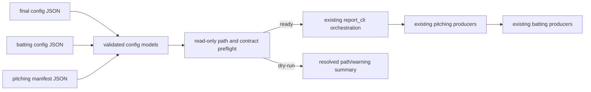

# Stage 1 — Configuration and Path Boundary

> Repository: `baseball-report-generation`
>
> Branch: `refactor/systematic-engineering`
>
> Completed: 2026-07-17

## Changes Made

- Consolidated final-report, batting-pipeline, pitching-alignment, and pitching
  manifest parsing in `scripts/pipeline_config.py`.
- Added frozen configuration models for final report orchestration, batting,
  pitching alignment, manifest athletes, and preflight results.
- Made CLI config paths resolve from the repository root instead of the
  caller's current working directory. Existing `root_dir` semantics remain
  repository-relative for compatibility.
- Kept pitching manifest C3D paths relative to the manifest file, matching the
  existing pitching builder.
- Added validation for required paths/text/numbers, reviewed video FPS and
  event frames, player slugs, manifest roles, unique athlete keys, and exactly
  one `key="coach"` coach row.
- Added cross-config checks so the batting player, first pitching student, and
  pitching alignment player/C3D cannot silently refer to different athletes.
- Added output isolation checks between the pitching report and combined
  batting report.
- Added a read-only `--dry-run` to all three public executions. It prints
  resolved paths and warnings, performs no output-directory creation, and
  invokes no producer.
- Centralized the existing `MPLCONFIGDIR` and `XDG_CACHE_HOME` defaults while
  preserving explicit environment overrides.
- Retained `report_cli.load_config`, `execution_env`, and the batting
  `plot_env` names as compatibility wrappers.

## Files Added

- `tests/test_pipeline_config.py`
- `docs/stage1_configuration.md`

## Files Modified

- `scripts/pipeline_config.py`
- `scripts/report_cli.py`
- `scripts/run_batting_report_pipeline.py`
- `README.md`
- `scripts/README.md`
- `docs/refactor_plan.md`

No metric, event, C3D reader, pose estimator, visualization, report template,
report copy, or frontend/report builder implementation was changed.

## Data Flow Impact

The calculation and artifact flow is unchanged. A read-only gate now runs
before the existing orchestration:



`final` still calls pitching first and batting second. `pitching` and `batting`
retry scopes retain their existing command lists and public meaning.

## Numerical Impact

None. Phase 4 protected baselines remained identical after the Stage 1
changes, including event frames, metric values, units, report DOM structure,
chart hashes, workbook hash, and artifact inventory.

The new checks consume configuration metadata only. They do not read or
transform point coordinates and do not invoke MediaPipe, RTMPose, C3D metric
calculation, event detection, chart rendering, or report generation during a
dry run.

## Compatibility

- Existing `pitching`, `batting`, and `final` CLI commands remain valid.
- Existing relative final/batting config semantics remain repository-root
  relative.
- Both object manifests (`{"athletes": [...]}`) and the legacy top-level
  athlete array remain readable.
- Existing cache environment values override project defaults as before.
- A missing configured batting peer directory remains a warning because the
  current builder intentionally falls back to report CSV discovery.
- Existing output directories are reported as overwrite warnings; Stage 1
  does not add deletion, migration, or automatic cleanup.
- No config or old entry was deleted.

## Validation

- 10 Stage 1 configuration/CLI tests passed.
- The full suite passed with all protected integrations enabled:

```text
Ran 44 tests
OK
```

- All six Git-tracked final configs passed a real read-only `final --dry-run`:
  `7zai`, `branden`, `bryan`, `green`, `james`, and `youyou`.
- A Bryan dry run also succeeded when the public CLI was launched from
  `/private/tmp`, confirming that config resolution no longer depends on the
  caller's working directory.
- New/modified Python files passed `py_compile` and the staged patch passed
  `git diff --cached --check`.

## Known Issues

1. Bryan's tracked final config uses the same directory for
   `pitching.template_dir` and `pitching.out_dir`. Preflight now exposes this
   overwrite risk, but keeps it advisory in Stage 1 to avoid silently changing
   the authoritative tracked template or output location.
2. The configured batting peer directory is absent for Bryan, 7zai, and Green
   in the current workspace. This is an explicit warning, not an error,
   because the current builder falls back to its report-CSV peer discovery.
3. Existing output directories produce warnings. An explicit overwrite mode
   and recoverable output transaction have not been introduced yet.
4. Preflight verifies file/directory existence, cross-config identity, and
   reviewed timing metadata. It does not decode every C3D, open every video,
   initialize a pose model, or render a test chart; those remain integration
   responsibilities.
5. The compatibility configuration boundary remains under `scripts/` because
   the public CLI is not yet installed as a `src/` package entry. Moving it
   prematurely would require `PYTHONPATH`, editable installation, or a
   prohibited `sys.path` workaround.
6. Physical Vicon coordinate-axis semantics, legacy frame-label behavior, and
   vendor angle channels remain outside this configuration-only stage.

## Next Phase

Proceed to Stage 2: migrate the first legacy producers through the Phase 3
core data models using adapters. The initial scope will preserve existing
CSV/JSON outputs in parallel, compare them against Phase 4 baselines, and
avoid switching report consumers until equivalence is demonstrated.
