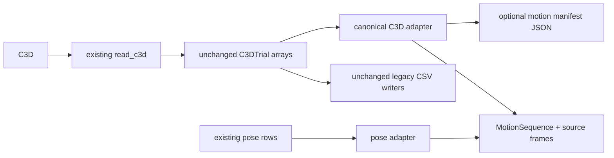

# Stage 2 — Canonical Frame and Motion Metadata

> Repository: `baseball-report-generation`
>
> Branch: `refactor/systematic-engineering`
>
> Completed: 2026-07-17

## Changes Made

- Added canonical C3D header inspection and a read-only adapter from the
  current `C3DTrial` into `MotionSequence`.
- Preserved the complete legacy `frames × points × 4` array and residual
  channel alongside named XYZ point series and validity masks.
- Added first/last C3D source frames, storage type, scale factor, raw/clean
  labels, coordinate profile, unit, frame convention, and provenance.
- Added `MotionSequence.frame_reference()` and `last_source_frame` so callers
  can distinguish loaded zero-based indices from original source frames.
- Added a pose-row adapter for MediaPipe and the RTMPose fallback, including
  backend capability/provenance, confidence, validity, and explicit source
  video frame numbers.
- Correctly retained non-contiguous sampled video frame identities. A single
  pose frame now requires an explicit FPS instead of guessing one.
- Added optional `--motion-manifest-out` support to the legacy C3D metrics
  producer and `--save-motion-manifest` to the internal C3D orchestration.
  Existing CSVs and default command behavior remain unchanged.

## Files Added

- `src/baseball_report/io/__init__.py`
- `src/baseball_report/io/c3d.py`
- `src/baseball_report/io/pose_csv.py`
- `tests/test_motion_io.py`
- `docs/stage2_motion_io.md`

## Files Modified

- `src/baseball_report/core/motion.py`
- `scripts/build_vicon_2026_metrics.py`
- `scripts/run_vicon_c3d_pipeline.py`
- `tests/characterization/test_c3d_readers.py`
- `tests/integration/test_real_characterization_baselines.py`
- `docs/refactor_plan.md`

## Data Flow Impact

The canonical path is additive and does not replace a legacy consumer:



No report builder, event detector, metric calculator, or visualization has
been switched to the canonical model yet.

## Numerical Impact

None. For synthetic and protected real C3D cases:

- the complete legacy point arrays compare element-wise with zero tolerance;
- NaN masks are identical;
- residual values are identical;
- loaded zero-based timestamps are identical;
- frame count, point count, rate, unit, and labels are unchanged;
- the new source-frame numbers come directly from the C3D header.

All Phase 4 event, metric, HTML, XLSX, chart, and artifact baselines remained
unchanged.

## Compatibility

- `C3DTrial` retains its original positional fields and adds metadata fields
  with defaults for existing synthetic/manual construction.
- Legacy CSV field names, zero-based `frame_index`, timestamps, and writers are
  unchanged.
- The motion manifest is opt-in and therefore does not alter existing artifact
  inventories.
- MediaPipe and RTMPose continue producing the same long-form transport rows;
  the adapter is a read-only consumer.
- RTMPose remains explicitly degraded: 17 native points, duplicated 33-row
  transport semantics, and no depth capability.

## Validation

- Added six canonical C3D/pose adapter tests.
- Updated four C3D reader characterization tests for the additive header
  fields.
- Added protected real batting and pitching C3D adapter comparisons.
- Full validation with all protected inputs enabled:

```text
Ran 51 tests
OK
```

- New/modified Python files passed `py_compile` and the staged patch passed
  `git diff --cached --check`.

## Known Issues

1. The main legacy reader now exposes first/last frame, storage, and scale, but
   still does not expose analog channels or embedded C3D events.
2. The separate sync reader remains floating-point-only and intentionally
   retains its different all-zero invalid-point rule until reader
   consolidation has an approved compatibility policy.
3. Canonical C3D adaptation currently rereads the 512-byte header after the
   legacy reader. It avoids changing the proven decoder but is not the final
   single-reader implementation.
4. C3D point keys use raw labels with stable `#N` suffixes for duplicates.
   Baseball marker aliases and derived anatomical points remain a Stage 4
   mapping responsibility.
5. Non-millimetre C3D inputs are labeled with an unknown coordinate profile;
   no implicit unit conversion is performed.
6. The motion manifest is an optional internal artifact and is not yet part of
   the public report schema or default final pipeline.
7. Automatic pose subset event inference still returns a subset ordinal in
   the legacy detector. The canonical adapter preserves explicit source frame
   identity but does not silently alter that detector's result.

## Next Phase

Proceed to Stage 3: extract duplicated finite-statistic, marker averaging,
speed, and angle primitives as pure functions. Switch callers one bounded
group at a time and require exact protected event/metric/report baselines after
each group.
