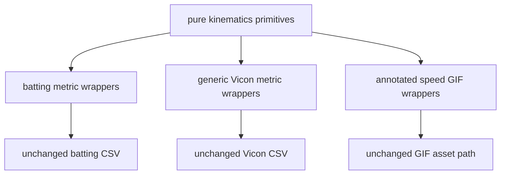

# Stage 3 — Shared Kinematics Primitives

> Repository: `baseball-report-generation`
>
> Branch: `refactor/systematic-engineering`
>
> Completed: 2026-07-17

## Changes Made

- Added pure, file-independent primitives for finite reductions, first-
  difference speed/velocity, joint/vector/XY angles, wrapped differences, and
  signed angles about a 3D axis.
- Declared input/output units and angle ranges in each primitive docstring.
- Preserved the generic C3D reader's direct-division joint-angle variant as a
  separately named function instead of pretending it is identical to the
  zero-denominator-guarded batting variant.
- Converted the current batting metric producer, generic Vicon metric
  producer, and annotated-speed visualization to compatibility wrappers around
  the shared primitives.
- Kept every public/legacy function name and signature callable.

## Files Added

- `scripts/kinematics.py`
- `tests/test_kinematics.py`
- `docs/stage3_kinematics.md`

## Files Modified

- `scripts/build_batting_dashboard_metrics.py`
- `scripts/build_vicon_2026_metrics.py`
- `scripts/build_julian_coach_annotated_speed_gifs.py`
- `docs/refactor_plan.md`

## Data Flow Impact

File and report data flow is unchanged. Three callers now share an in-memory
math boundary:



The primitives accept arrays and scalars only. They do not read files, infer
events, create figures, write reports, or access global configuration.

## Numerical Impact

None. Wrapper and primitive arrays were compared element-wise with zero
tolerance, including NaN positions. All protected batting/pitching event and
metric baselines and the generated report artifact baseline passed unchanged.

The existing operation order is retained. In particular:

- speed remains first difference, mm → m → km/h, with a leading NaN;
- velocity remains first difference in mm/s with a leading NaN vector;
- joint angles remain unsigned 0–180 degrees;
- circular difference remains signed in `[-180, 180)`;
- signed axis angle retains the existing radial/reference orientation.

## Compatibility

- Old function names remain wrappers.
- Legacy CSV, JSON, chart, GIF, and report contracts are unchanged.
- The pre-existing CSV field-size worktree change was explicitly excluded from
  the Stage 3 commit and remains owned by the user's separate edits.
- Smoothing and missing-data variants that are not behaviorally identical were
  not merged.

## Validation

- Added five primitive/wrapper tests covering finite/empty values, units,
  angle ranges, degeneracy, orientation, and zero-tolerance wrapper parity.
- Full validation with all protected inputs enabled:

```text
Ran 56 tests
OK
```

- Changed files passed `py_compile`; the staged patch passed
  `git diff --cached --check`.

## Known Issues

1. The shared compatibility module remains in `scripts/` until the installed
   `src/` CLI boundary exists; moving it now would reintroduce `PYTHONPATH` or
   `sys.path` dependence.
2. Pitching and sync-specific speed/smoothing functions deliberately remain
   separate because they interpolate, smooth, or use m/s at different stages.
3. The generic C3D direct-division angle and guarded batting angle remain
   separate named variants. Their finite outputs match, but warning/degenerate
   behavior is not silently unified.
4. Curvature, height/floor estimation, and plotting-only moving averages have
   not yet been migrated.
5. Some report visualization code still contains derived series calculations;
   those consumers move only after Stage 5/6 event and metric ownership is
   established.

## Next Phase

Proceed to Stage 4: centralize MediaPipe, RTMPose, Vicon marker/channel, side,
and render-only skeleton mappings as versioned data while preserving current
fallback order and right-side assumptions.
