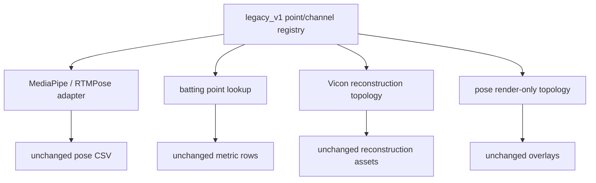

# Stage 4 — Point and Channel Mappings

> Repository: `baseball-report-generation`
>
> Branch: `refactor/systematic-engineering`
>
> Completed: 2026-07-17

## Changes Made

- Added a versioned `legacy_v1` registry for the 33 report landmark names,
  RTMPose COCO17 adaptation, batting and pitching marker aliases, pitching
  angle channels, current right-handed role profiles, Vicon body segments,
  raw marker groups, bat markers, and foot markers.
- Kept analysis point aliases separate from render-only skeleton connections.
- Preserved the intentional difference between the 18-edge aligned pose
  overlay and the 16-edge geometry annotation overlay.
- Converted MediaPipe/RTMPose alignment, both pose renderers, Vicon
  reconstruction, and batting metric point lookup to compatibility aliases
  backed by the registry.
- Explicitly labeled the current batting and pitching side profiles as
  right-handed legacy behavior; this stage does not claim left-handed support.

## Files Added

- `scripts/point_mappings.py`
- `tests/test_point_mappings.py`
- `docs/stage4_point_mappings.md`

## Files Modified

- `scripts/align_2d_video_vicon.py`
- `scripts/build_batting_dashboard_metrics.py`
- `scripts/render_aligned_2d_overlay.py`
- `scripts/render_vicon_geometry_metrics_on_2d.py`
- `scripts/render_vicon_reconstruction_images.py`
- `docs/refactor_plan.md`

## Data Flow Impact

The serialized data flow is unchanged. In-memory point/channel selection now
has one declared source:



No new file format, stage, temporary artifact, or report field was introduced.

## Numerical Impact

None. Alias tuple order exactly preserves the former marker averaging and
fallback order. The full fixed-sample event, metric, report, and artifact
characterization suite passed.

The pre-refactor reconstruction definitions were locked by hashes:

- body segments: 44;
- deduplicated model edges: 83;
- raw body markers: 39;
- marker part groups: 7.

Landmark indices, side assignments, coordinate systems, units, event frames,
metric formulas, and report values were not changed.

## Compatibility

- Existing module constants such as `LANDMARK_NAMES`, `RTMPOSE_COCO17`,
  `BODY_SEGMENTS`, and `BAT_MARKERS` remain available in their legacy mutable
  list/dict/set shapes.
- Public scripts, CLI arguments, CSV/JSON fields, asset names, HTML, and the
  tracked authoritative `reports/pitching_bryan_coach/index.html` template are
  unchanged.
- The user's independent CSV field-size worktree edit was excluded from the
  Stage 4 commit.

## Validation

- Added four mapping contract tests covering exact pose adaptation, distinct
  render topologies, explicit side/channel profiles, and reconstruction hashes.
- Focused pose alignment and batting metric characterization passed.
- Full validation with protected sample paths enabled:

```text
Ran 60 tests
OK
```

- The staged patch passed `git diff --cached --check`.

## Known Issues

1. Current production batting and pitching rules are still right-handed only;
   the registry documents that limitation but does not generalize it.
2. Pitching marker/channel consumers remain inside the current template
   builder until their event/metric functions are migrated with selective
   parity tests; the authoritative registry already records their current
   labels.
3. Render model topology includes visualization-specific complete graphs and
   must not be treated as an anatomical or metric definition.
4. Missing aliases retain the legacy NaN behavior. Structured warnings belong
   to the typed event/metric stage so existing CSV output is not changed here.
5. Mapping data remains in `scripts/` until the installed `src/` entry boundary
   can import it without adding path hacks.

## Next Phase

Proceed to Stage 5: wrap the existing batting and pitching event detectors in
a versioned typed registry, preserve exact windows/thresholds/fallbacks, and
prove fixed-sample event-frame parity before moving any formulas.
