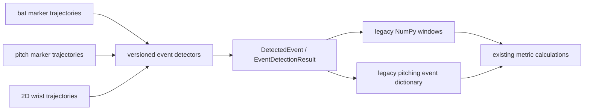

# Stage 5 — Event Detection

> Repository: `baseball-report-generation`
>
> Branch: `refactor/systematic-engineering`
>
> Completed: 2026-07-17

## Changes Made

- Added immutable typed detector results with event ID, ordered window,
  primary frame, detector version, rule, source, confidence slot, metadata,
  and warnings collection.
- Centralized the current batting swing segment, Ready Position, Contact
  Position proxy, pitching peak-knee, foot-contact, foot-plant, and release
  rules.
- Centralized the generic Vicon key-action anchor and the 2D wrist-speed video
  alignment anchor.
- Retained every legacy detector function/signature as an adapter returning
  the same NumPy arrays, tuples, dictionaries, labels, and rule IDs.
- Recorded fallback selection in typed metadata rather than silently
  presenting fallback frames as measured events.

## Files Added

- `scripts/event_detection.py`
- `tests/test_event_detection.py`
- `docs/stage5_event_detection.md`

## Files Modified

- `scripts/build_batting_dashboard_metrics.py`
- `scripts/build_vicon_2026_metrics.py`
- `scripts/align_2d_video_vicon.py`
- `scripts/pitching/build_pitch_template_metrics_report.py`
- `docs/refactor_plan.md`

## Data Flow Impact

Detector ownership changed; persisted contracts did not:



Metric calculation, visualization, report schema, and HTML builder still
consume their existing adapters during this compatibility stage.

## Numerical Impact

None. Fixed-sample event frames/windows matched exactly:

- batting Ready and Contact windows;
- batting raw/expanded swing segment and peak;
- pitching peak knee, foot contact, foot plant, and release;
- generic Vicon and 2D alignment peak/midpoint behavior.

The complete metric values, units, formulas, report structure, report assets,
coordinate conventions, and event rule strings remained unchanged. The full
protected suite passed with existing numerical tolerances.

## Compatibility

- Legacy event APIs remain importable and preserve return shapes.
- Existing CSV/JSON event names and fields are unchanged.
- `Contact Position` remains explicitly a lowest-`Bat1_Z` proxy, not verified
  ball contact.
- `release` remains a throwing-hand-speed proxy, not measured ball release.
- User-owned changes in both mixed worktree files were excluded through
  selective staging and remain uncommitted.

## Validation

- Added six typed event tests covering invariants, exact golden parity,
  ordering, provenance, and no-finite-data fallbacks.
- Existing batting, pitching, C3D, pose-alignment, report, and integration
  characterization passed.
- Full protected run:

```text
Ran 66 tests
OK
```

- Changed modules passed `py_compile`; staged content passed
  `git diff --cached --check`.

## Known Issues

1. `Ready Position`, `Contact Position`, and pitching release are repository-
   specific proxies; their display labels must not imply independent ground
   truth.
2. Pitching side roles are still the explicitly documented right-handed
   `legacy_v1` profile.
3. User-reviewed video event frames can override the automatic 2D event. That
   reviewed frame remains authoritative and is not recomputed by this layer.
4. Typed detector code remains in `scripts/` until the installed package CLI
   can preserve direct-script imports without `sys.path` workarounds.
5. Existing legacy JSON adapters construct public `MotionEvent` contracts from
   stored results; direct typed-detector-to-ReportData wiring belongs to the
   explicit pipeline/schema stages.

## Next Phase

Proceed to Stage 6: establish the metric registry and migrate related batting
and pitching calculation groups through pure functions, comparing every fixed
sample value, unit, event, side, rounding rule, and missing-data behavior.
