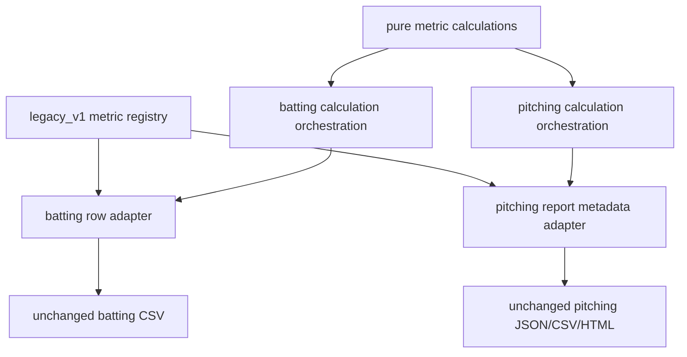

# Stage 6 — Metric Registry and Calculators

> Repository: `baseball-report-generation`
>
> Branch: `refactor/systematic-engineering`
>
> Completed: 2026-07-17

## Changes Made

- Added immutable `legacy_v1` definitions for all 17 batting report metrics
  and all 18 pitching report metrics.
- Declared Chinese/English names, units, report event/section, formulas,
  required points/channels, side rules, missing-data policy, and existing
  report scoring/display options.
- Declared units for all 23 pitching auxiliary values and all 11 generic Vicon
  summary metrics, preventing untyped values from silently entering reports.
- Removed the duplicate pitching `METRICS` table from the report builder; its
  legacy dictionary contract is now generated from the registry.
- Made batting row construction validate registry identity, unit, and event so
  code/report drift fails immediately.
- Extracted pure calculations for head displacement, COM risk, hitting-zone
  stability, stride distance/direction, and release arm slot; legacy callers
  retain their old signatures and output dictionaries.

## Files Added

- `scripts/metric_registry.py`
- `scripts/metric_calculations.py`
- `tests/test_metric_registry.py`
- `docs/stage6_metric_registry.md`

## Files Modified

- `scripts/build_batting_dashboard_metrics.py`
- `scripts/pitching/build_pitch_template_metrics_report.py`
- `docs/refactor_plan.md`

## Data Flow Impact



File readers, event detectors, chart generators, report prose, and exporters
remain outside the metric primitives.

## Numerical Impact

None. All 17 batting values and all 41 pitching values matched their fixed
sample golden values within the existing `1e-9` tolerance. Event frames,
units, side rules, formulas, rounding behavior, scoring thresholds, report
registry hash, report structure, and artifacts were unchanged.

Hand speed remains the Vicon throwing-hand proxy in km/h and is not relabeled
as ball speed. Contact bat speed remains the event-window mean rather than the
maximum swing speed.

## Compatibility

- `METRICS` remains a list of legacy dictionaries for every existing pitching
  consumer, now generated from the registry.
- Batting `metric_row`, `compute_trial_metrics`, and CSV fields are unchanged.
- Existing auxiliary pitching JSON keys remain present and now have declared
  units.
- No old command, JSON/CSV field, builder, chart, score, or narrative changed.
- User-owned worktree edits were excluded through selective staging.

## Validation

- Registry tests verify exact ordering, immutable options, formula/point
  completeness, all 41 pitching outputs, all 11 generic units, and the existing
  report registry SHA-256.
- Pure calculator tests verify numerical units and representative exact values.
- Full protected run:

```text
Ran 71 tests
OK
```

- Changed files passed `py_compile` and staged-diff checks during the three
  intent-based Stage 6 commits.

## Known Issues

1. Registry/calculator compatibility modules remain under `scripts/` until the
   installed package CLI can preserve direct legacy script execution.
2. The package legacy pitching adapter still contains a mirrored compact
   report metadata table; tests protect it now, and Stage 8 schema migration
   will make the package registry the direct owner.
3. Batting calculation orchestration is a large pure in-memory function even
   though its reusable primitives are separated. Further splitting is allowed
   only by metric family with golden comparison, not as a wholesale rewrite.
4. Pitching contains 23 auxiliary outputs used by charts/narratives but only
   18 report-card metrics. The registry intentionally distinguishes them.
5. Existing score ranges and report copy are presentation/product rules and
   were recorded, not changed.

## Next Phase

Proceed to Stage 7: introduce explicit stage results, logging, and orchestration
for C3D extraction, batting analysis, pitching analysis, and final report
generation while retaining every public legacy script as a wrapper.
