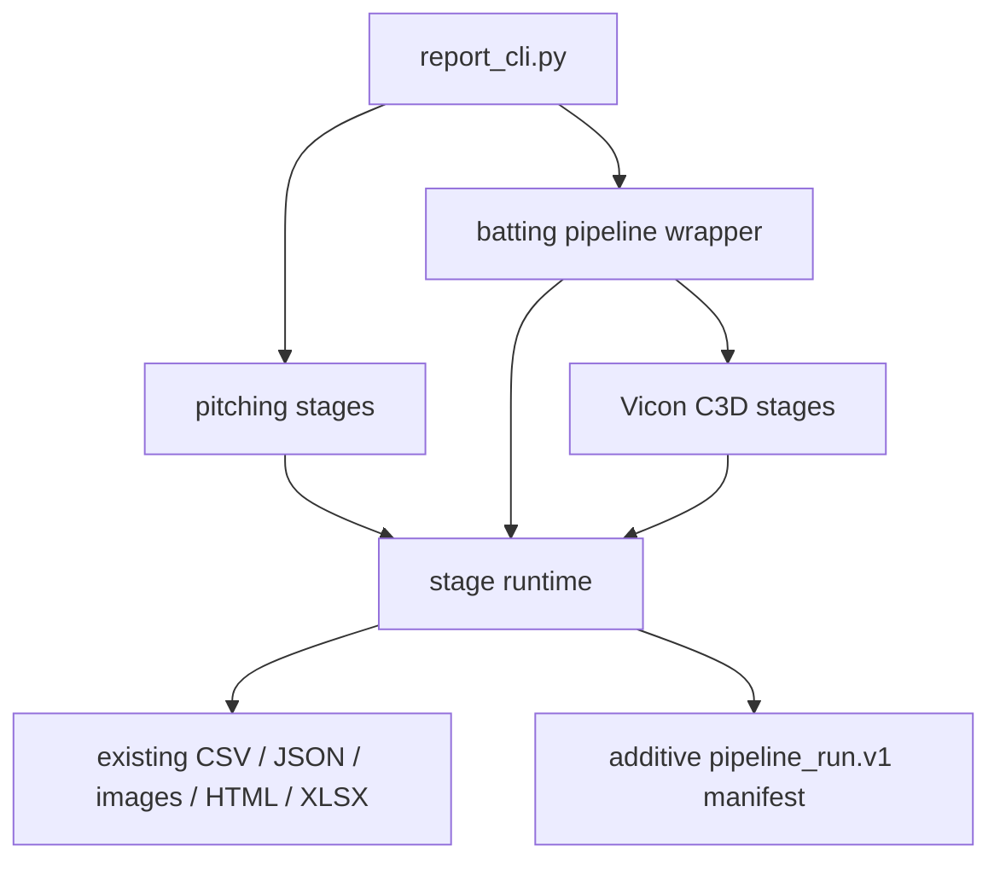

# Stage 7 — Explicit Pipelines, Stage Results, and Logging

> Repository: `baseball-report-generation`
>
> Branch: `refactor/systematic-engineering`
>
> Completed: 2026-07-17

## Changes Made

- Added a shared command-stage runtime with stage name, normalized command,
  input/output summaries, artifact paths, warnings, duration, and success.
- Added structured logging at stage start, success, and failure; ordinary
  per-frame activity remains outside default logs.
- Added atomic `pipeline_run.v1` JSON manifests for Vicon C3D extraction,
  batting report generation, and public pitching/batting/final orchestration.
- Made missing required artifacts and child-process failures stage-scoped
  errors while preserving the original nonzero CLI behavior.
- Added `--log-level` and `--run-manifest` without changing existing defaults,
  inputs, output filenames, or public commands.
- Kept `scripts/report_cli.py` as the sole public report entry and retained all
  old orchestration scripts as compatible entries.

## Files Added

- `scripts/pipeline_runtime.py`
- `tests/test_pipeline_runtime.py`
- `docs/stage7_pipeline_runtime.md`

## Files Modified

- `scripts/run_vicon_c3d_pipeline.py`
- `scripts/run_batting_report_pipeline.py`
- `scripts/report_cli.py`
- `docs/refactor_plan.md`

## Data Flow Impact



Subprocess boundaries still exist for compatibility, but they are no longer
implicit: each invocation has a stable stage identity, timing, failure scope,
and ordered manifest entry.

## Numerical Impact

None. The runtime does not read or transform motion arrays, events, metrics,
coordinates, units, sides, scores, charts, or report text. All protected
numerical and report artifact baselines passed unchanged.

## Compatibility

- Existing commands and arguments continue to work.
- New run manifests are additive; no existing artifact is renamed or removed.
- Child process exit codes remain failures and are surfaced with the stage
  name rather than swallowed.
- `--dry-run` remains non-mutating and does not create a run manifest.
- No main-branch merge or legacy-entry deletion occurred.

## Validation

- Runtime tests cover successful execution, missing artifacts, child exit-code
  propagation, timing, ordered JSON serialization, and atomic manifest writes.
- CLI help smoke tests confirm new options on the three orchestrators.
- Full protected run:

```text
Ran 74 tests
OK
```

## Known Issues

1. Compatibility orchestration still uses subprocesses; Stage 11 package CLI
   will invoke package-owned pipelines directly where parity is proven.
2. Inner C3D and batting pipelines write their own manifests while the public
   command records the child stage. This nested provenance is intentional but
   has not yet been linked by manifest ID.
3. Some leaf scripts still use `print`; default pipeline-level state now uses
   logging, and leaf migration will occur only when those scripts are touched.
4. Failure manifests are not persisted after an interrupted child command;
   the exception and log are explicit, but durable partial-run state requires
   a later transactional output policy.
5. Run manifests add artifact provenance but do not replace the ReportData
   schema introduced next.

## Next Phase

Proceed to Stage 8: stabilize ReportData, validate the Python/report-builder
boundary, and provide adapters from legacy batting CSV and pitching JSON while
preserving current static HTML builders and historical data.
