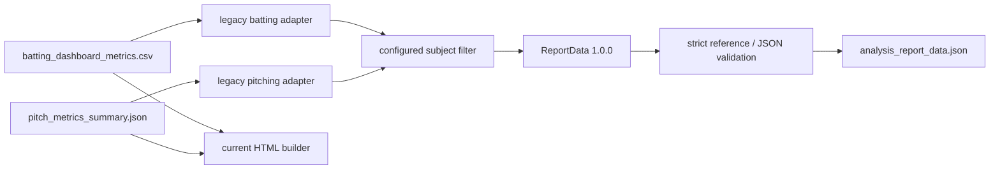

# Stage 8 — Stable ReportData Contract

> Repository: `baseball-report-generation`
>
> Branch: `refactor/systematic-engineering`
>
> Completed: 2026-07-17

## Changes Made

- Promoted the additive report contract from internal `0.x` to stable
  `ReportData 1.0.0`; `0.x` remains readable by Python compatibility models,
  while the builder boundary accepts only `1.0.x`.
- Added validation for required fields, subject identity, finite JSON values,
  unique IDs, sorted section order, portable file references, and every
  motion/event/metric/comparison/chart/asset reference.
- Added a legacy adapter from the current long-form batting CSV and pitching
  summary JSON. Subject filtering prevents coach/peer bundles from being
  represented as the report subject's own motion results.
- Added atomic `analysis_report_data.json` writing alongside current batting
  pipeline outputs. The file is read back through the strict validator before
  the stage succeeds.
- Converted non-finite values found in legacy nested metadata to JSON `null`
  and attached `legacy.metadata.non_finite` warnings. Finite metric values are
  not transformed.
- Kept the current HTML and XLSX consumers on their existing legacy artifacts;
  switching the authoritative static builder is Stage 9 work.

## Files Added

- `src/baseball_report/legacy/json_values.py`
- `src/baseball_report/reporting/adapters.py`
- `src/baseball_report/reporting/build_legacy.py`
- `src/baseball_report/reporting/validation.py`
- `tests/test_report_schema_validation.py`
- `docs/stage8_report_schema.md`

## Files Modified

- `src/baseball_report/legacy/batting_csv.py`
- `src/baseball_report/legacy/pitching_summary.py`
- `src/baseball_report/reporting/__init__.py`
- `src/baseball_report/reporting/models.py`
- `scripts/run_batting_report_pipeline.py`
- `tests/test_phase3_contracts.py`
- `tests/integration/test_real_characterization_baselines.py`
- `docs/refactor_plan.md`

## Data Flow Impact



The new JSON is additive. Existing production consumers are not redirected in
this stage.

## Numerical Impact

None for finite values. No event detector, event index/window, metric formula,
rounding rule, unit, coordinate profile, side rule, score, reference value, or
report copy was changed. Non-standard nested legacy `NaN` values are represented
as standards-compliant `null` plus a warning at the new contract boundary; the
legacy source artifacts remain unchanged.

## Compatibility

- Existing scripts, flags, CSV, JSON, HTML, XLSX, filenames, and builders remain
  supported.
- `analysis_report_data.json` is additive and uses only report-root-relative
  asset references when assets are later registered.
- Python models retain `0.x.y` compatibility; the external builder contract is
  explicitly `1.0.x`.
- No TypeScript interface was invented because the repository has no
  TypeScript report consumer.
- No old entry was deleted and no main-branch merge occurred.

## Validation

- Contract tests cover stable/legacy schema versions, required fields,
  unavailable values, NaN/Infinity rejection, subject fields, section order,
  portable paths, subject filtering, and dangling references.
- A protected Bryan adapter smoke test produced two motion records and 58
  finite/unavailable metric results across batting and pitching.
- The protected end-to-end suite, including both C3D numerical baselines and
  report artifact baselines, passed:

```text
Ran 80 tests
OK
```

## Known Issues

1. The static HTML builder still reads legacy CSV/JSON. This is deliberate;
   Stage 9 must first freeze the Git-tracked canonical template and prove DOM,
   asset, and rendering parity before switching the consumer.
2. Peer/coach results are excluded from subject motions but are not yet emitted
   as typed `ComparisonResult` records. Stage 9 owns that exact-rule migration.
3. Current assets and charts are not yet enumerated in ReportData; Stage 10
   will register them after data-series and filename parity tests.
4. `validate-report` is an internal validation API/module at this point; the
   supported package CLI is introduced in Stage 11.
5. The schema is maintained in Python only because no TypeScript consumer
   exists in this repository.

## Next Phase

Proceed to Stage 9: separate comparison/composition/asset responsibilities,
freeze the latest Git-tracked `reports/pitching_bryan_coach/index.html` as the
authoritative template baseline, and migrate one static renderer without
changing visual design, copy, scores, or report section order.
