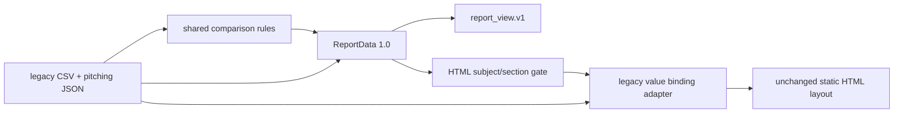

# Stage 9 — Reporting and Static HTML Boundaries

> Branch: `refactor/systematic-engineering`
>
> Completed: 2026-07-17

## Changes Made

- Froze the latest Git-tracked canonical pitching template contract at
  `reports/pitching_bryan_coach/index.html` with SHA-256
  `2b2c39e55f3c4ad87c21784db0d5b705b9f8c33aa1a13bf36bf7a38d46dfad21`
  and DOM shape tests (7 sections, 16 metric cards, 28 peer ranges).
- Extracted exact pitching score/status/peer statistics and batting
  status/component-score/peer statistics into pure package functions. Legacy
  builder functions remain compatibility wrappers.
- Added explicit peer membership provenance through `ComparisonResult`.
  Student group statistics retain current membership; coach values remain
  separate references.
- Added renderer-facing `report_view.v1`, resolving ordered section references
  to metrics, comparisons, events, charts, and assets. It exposes 17 batting
  and 18 report-facing pitching metrics; 23 pitching auxiliary metrics remain
  in ReportData but outside report sections.
- Added a scoped report asset copier that rejects source/destination overlap
  and ignores platform sidecars.
- Made the current combined HTML builder validate ReportData subject and
  batting section before rendering. Legacy CSV remains the numerical binding
  adapter during compatibility.

## Files Added

- `src/baseball_report/comparison/legacy_rules.py`
- `src/baseball_report/reporting/assets.py`
- `src/baseball_report/reporting/composition.py`
- `src/baseball_report/reporting/template_contract.py`
- `tests/test_stage9_reporting.py`
- `docs/stage9_reporting.md`

## Files Modified

- `src/baseball_report/comparison/__init__.py`
- `src/baseball_report/reporting/__init__.py`
- `src/baseball_report/reporting/adapters.py`
- `src/baseball_report/reporting/build_legacy.py`
- `scripts/pipeline_config.py`
- `scripts/pitching/build_pitch_template_metrics_report.py`
- `scripts/build_julian_coach_metrics_section.py`
- `scripts/run_batting_report_pipeline.py`
- Stage 8/9 tests and `docs/refactor_plan.md`

## Data Flow Impact



## Numerical Impact

None. New pure functions are tested against the legacy wrappers at threshold
boundaries. Peer membership, means/min/max, coach references, scoring
thresholds, units, event frames, and report-facing metric counts remain equal.

## Compatibility

- `scripts/report_cli.py` remains the only public entry.
- Existing HTML/CSS/copy, XLSX, filenames, and export commands remain intact.
- The second batting polish pass remains a compatibility stage.
- User working-tree changes to the canonical HTML and legacy builders were not
  included in refactor commits.
- No template was overwritten and no main-branch merge occurred.

## Validation

- Exact Git blob hash and DOM shape test.
- Old/new pitching and batting comparison-rule parity tests.
- Asset copy/overlap tests.
- ReportData comparison and report-view composition tests.
- Protected full regression:

```text
Ran 85 tests
OK
```

Post-stage local compatibility evidence covers all seven available player
reports (`7zai`, `branden`, `bryan`, `green`, `james`, `xuanxuan`, `youyou`).
For each report, ReportData 1.0.1 reconstructed all 34 player/coach metric rows
with identical trial, metric name, unit, event frame, formula, finite value,
and calculation components. The one legacy unavailable Youyou forearm-roll
value is intentionally normalized from CSV `NaN` to JSON `null`; both paths
render it unavailable. Every comparison preserved the configured eight-student
peer membership.

## Known Issues

1. Resolved after Stage 9: the HTML builder and final polish bind batting,
   coach-reference, and peer values from ReportData 1.0.1. Legacy CSV/peer
   arguments remain fallback-compatible for direct historical invocations.
2. `apply_batting_coach_values.py` remains a second in-place compatibility
   pass. It cannot be removed until its transformations are reproduced in one
   renderer and two subjects pass DOM/screenshot/export comparison. The
   two-subject data-row gate is satisfied; visual/export gates are not yet
   claimed.
3. Comparison scores are preserved in shared functions, but ReportData does
   not claim a score for legacy direct metrics where the visible card is a
   weighted composite.
4. Narrative copy stays in legacy builders to avoid an unreviewed wording
   change; extracting it is safe only with byte/DOM parity fixtures.

## Next Phase

Proceed to Stage 10: make chart/overlay producers declare their typed series,
events, and asset manifests without changing plotting calculations, filenames,
image dimensions, or codecs.
