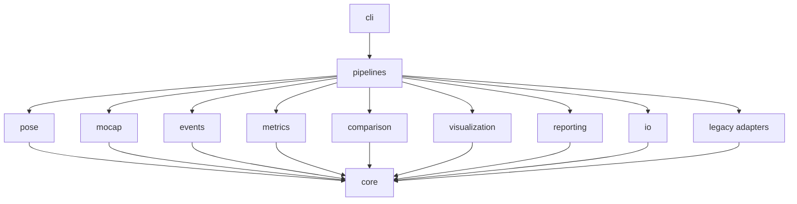
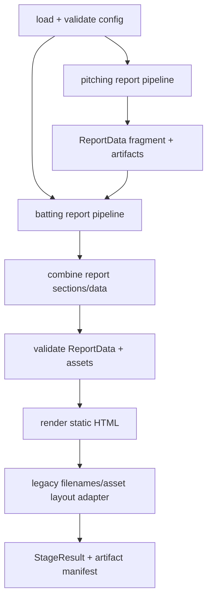
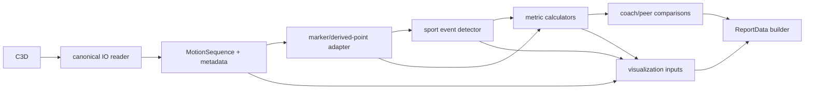
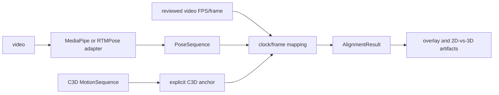
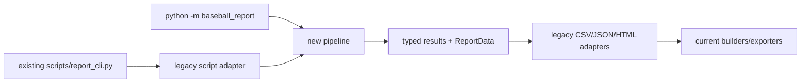

# Target Architecture

> Repository: `baseball-report-generation`
>
> Phase: 2 — architecture design only
>
> Based on: `docs/repository_audit.md`
> Numerical policy: preserve all existing algorithms, event indices, units,
> coordinate assumptions, scores, copy, and report output until a separately
> reviewed change is supported by characterization evidence.

## 1. Architectural objective

The target is a modular monolith, not a microservice system. One Python
process/package owns C3D/video ingestion, event and metric computation,
visualization preparation, report-data construction, and pipeline
orchestration. The existing static HTML and Node export tools remain valid
delivery mechanisms.

The architecture must make these relationships explicit:

1. which raw source and trial produced each value;
2. which coordinate system, unit, side, event, and frame identity apply;
3. which algorithm implementation owns each event and metric;
4. which visualizations and report sections consume each result;
5. which compatibility adapter or legacy entry is still in use;
6. whether an artifact is analysis data, visual QA, report content, or export.

This design deliberately does not introduce a database, RAG, vector search,
Redis, agent framework, microservices, event bus, or message queue.

## 2. Repository-specific constraints

The target architecture accounts for confirmed current behavior:

- this repository and sibling `baseball-analysis` are independent repositories;
- C3D/Vicon is the source of displayed biomechanics metrics;
- MediaPipe/RTMPose supports 2D alignment and visual QA, not report metrics;
- batting Ready and Contact are multi-frame event windows;
- pitching events are single primary frames but may use search windows;
- current batting calculations assume right-handed batting;
- current pitching calculations assume a right-handed thrower;
- current C3D calculations assume millimetres, XY horizontal, and Z vertical;
- original C3D frame number and zero-based loaded-array index are different;
- final rendering is static HTML/CSS generated in Python;
- PDF/PPTX and XLSX remain optional Node-based export steps;
- all existing script entries must remain available during migration.

## 3. Target directory structure

The package name is `baseball_report`, not `baseball_analysis`, to avoid an
import and ownership collision with the sibling `baseball-analysis` project.

```text
baseball-report-generation/
├── src/
│   └── baseball_report/
│       ├── __init__.py
│       ├── __main__.py
│       ├── config/
│       │   ├── models.py
│       │   ├── loaders.py
│       │   ├── paths.py
│       │   └── validation.py
│       ├── core/
│       │   ├── enums.py
│       │   ├── errors.py
│       │   ├── frames.py
│       │   ├── motion.py
│       │   ├── provenance.py
│       │   └── results.py
│       ├── io/
│       │   ├── c3d.py
│       │   ├── video.py
│       │   ├── csv.py
│       │   ├── json.py
│       │   ├── report_data.py
│       │   └── artifacts.py
│       ├── pose/
│       │   ├── models.py
│       │   ├── mediapipe_adapter.py
│       │   ├── rtmpose_adapter.py
│       │   ├── mappings.py
│       │   └── alignment.py
│       ├── mocap/
│       │   ├── models.py
│       │   ├── mappings.py
│       │   ├── markers.py
│       │   ├── derived_points.py
│       │   └── coordinates.py
│       ├── events/
│       │   ├── models.py
│       │   ├── batting.py
│       │   ├── pitching.py
│       │   └── registry.py
│       ├── metrics/
│       │   ├── models.py
│       │   ├── geometry.py
│       │   ├── time_series.py
│       │   ├── batting.py
│       │   ├── pitching.py
│       │   └── registry.py
│       ├── comparison/
│       │   ├── models.py
│       │   ├── peers.py
│       │   ├── references.py
│       │   └── scoring.py
│       ├── visualization/
│       │   ├── models.py
│       │   ├── reconstruction.py
│       │   ├── pose_overlay.py
│       │   ├── metric_overlay.py
│       │   ├── charts.py
│       │   └── illustrations.py
│       ├── reporting/
│       │   ├── models.py
│       │   ├── adapters.py
│       │   ├── sections.py
│       │   ├── narratives.py
│       │   ├── assets.py
│       │   ├── validation.py
│       │   ├── html_builder.py
│       │   └── templates/
│       ├── pipelines/
│       │   ├── stages.py
│       │   ├── c3d_extraction.py
│       │   ├── video_alignment.py
│       │   ├── batting_report.py
│       │   ├── pitching_report.py
│       │   └── combined_report.py
│       ├── cli/
│       │   ├── parser.py
│       │   ├── commands.py
│       │   └── logging.py
│       └── legacy/
│           ├── batting_csv.py
│           ├── pitching_summary.py
│           ├── report_config.py
│           └── script_adapters.py
├── scripts/                    # retained compatibility wrappers/utilities
├── frontend/                   # not created until a real frontend exists
├── configs/
│   ├── schemas/
│   ├── mappings/
│   ├── templates/
│   └── generated/
├── assets/
├── tests/
│   ├── unit/
│   ├── characterization/
│   ├── integration/
│   ├── contracts/
│   └── fixtures/
├── examples/
├── docs/
├── reports/                    # generated products; canonical tracked pitching template remains here during compatibility
└── outputs/                    # generated exports
```

This is a target, not a request to create every directory immediately. A
directory is introduced only when a migrated responsibility and tests require
it.

## 4. Dependency rules

### 4.1 Allowed direction



Rules:

- `core` imports no pipeline, IO, visualization, reporting, or CLI module.
- `io` reads/writes data but does not calculate baseball events or metrics.
- `pose` does not generate report copy or C3D-derived metrics.
- `mocap` exposes standardized motion/marker data; it does not build reports.
- `events` and `metrics` accept in-memory domain objects, never file paths.
- `comparison` consumes completed metric results, not raw C3D/video.
- `visualization` consumes standardized sequences/events/metrics/chart data;
  it does not redefine report metrics.
- `reporting` consumes report-ready results and assets; it never runs
  MediaPipe, reads C3D, or computes joint geometry.
- `pipelines` is the only layer allowed to orchestrate stages across modules.
- `cli` parses arguments, configures logging, invokes a pipeline, prints a
  summary, and maps exceptions to exit codes.
- `legacy` adapters may depend on domain schemas but domain modules must never
  depend on legacy CSV/HTML structures.
- Node exporters consume versioned output files; Python domain modules do not
  import Node runtime concerns.

### 4.2 Prohibited dependencies

- event or metric modules importing HTML builders;
- chart code importing metric formulas;
- report builders reading C3D or video directly;
- CLI modules containing formulas or event detection;
- domain modules calling `sys.exit()`;
- new `sys.path.append/insert` workarounds;
- imports from the sibling `baseball-analysis` repository;
- generated `reports/` content imported as Python or treated as mutable source
  templates.

## 5. Module responsibilities

### 5.1 `config/`

Owns validated configuration models and path resolution.

- Resolve paths relative to an explicit config root using `pathlib.Path`.
- Represent current final config, batting config, pitching manifest, pose
  model, reviewed anchors, output policy, and report template selection.
- Validate required fields, allowed motion/source types, positive FPS, and
  distinct input/output identities.
- Preserve existing config JSON through adapters before introducing a new
  versioned config shape.
- Store mapping and detector parameters in named, documented configuration;
  do not relocate thresholds until characterization tests exist.
- Do not infer handedness or coordinate convention from filenames.

### 5.2 `core/`

Contains small stable domain types used by multiple pipelines:

- source type, motion type, side, handedness, role;
- unit and coordinate-system identifiers;
- frame references and frame ranges;
- motion sequence and data-quality summaries;
- provenance, warnings, artifact references and stage results;
- project exception hierarchy.

It is not a general dumping ground for formatting, plotting, CSV helpers, or
sport-specific calculations.

### 5.3 `io/`

Owns external data boundaries:

- one canonical C3D point reader;
- OpenCV video metadata/frame reader;
- legacy CSV and JSON serialization;
- versioned `ReportData` serialization;
- atomic artifact writing and overwrite policy.

The canonical C3D reader must retain, without changing current calculations:

- original `first_frame` and `last_frame`;
- loaded zero-based sequence index;
- point rate, units, raw and clean labels;
- residual/valid mask;
- storage type;
- analog/event availability metadata, even if unsupported.

It initially reproduces the current main reader's point arrays exactly. The
sync reader migrates only after equivalence tests cover its differences.

### 5.4 `pose/`

Owns video-pose inference and C3D/video time alignment:

- MediaPipe and RTMPose are adapters implementing the same pose-detector
  protocol but may advertise different landmark capabilities;
- the RTMPose adapter must not claim true MediaPipe 33-point semantics; its
  duplicated mappings are recorded in provenance;
- output uses a standardized `PoseSequence`/`MotionSequence` with confidence;
- reviewed `video_capture_fps` and event frame remain explicit inputs;
- automatic wrist-peak inference remains a diagnostic detector, not a report
  default;
- frame mapping returns explicit video and C3D frame references.

### 5.5 `mocap/`

Owns marker lookup, aliases, derived point centers and coordinate metadata.

- Marker and Vicon angle-channel mappings are centralized and versioned.
- Missing-marker decisions return data-quality warnings.
- Derived points reproduce current arithmetic means before any biomechanical
  joint-center reconstruction is considered.
- Coordinate metadata records assumptions; it does not silently transform
  existing points.
- Side/handedness mapping is explicit in `AnalysisContext`.

### 5.6 `events/`

Owns canonical event IDs and detectors.

- `batting.ready`, `batting.contact_proxy`,
  `batting.high_speed_zone`, `batting.bat_speed_peak`;
- `pitching.peak_knee`, `pitching.foot_contact`,
  `pitching.foot_plant`, `pitching.release_hand_speed_proxy`;
- video/sync anchors are separate IDs rather than aliases of biomechanical
  events.

Detectors return typed results with the exact current rule text, thresholds,
frames, primary frame and warnings. Single-frame and multi-frame events share
one collection interface.

### 5.7 `metrics/`

Owns pure or near-pure calculations and the metric registry.

- Geometry/time-series primitives remain functions.
- Simple metrics remain pure functions rather than artificial classes.
- Registry entries connect IDs and callables to metadata.
- Current batting, pitching, generic and visualization-only metrics remain
  distinguishable until owners decide which are contractual.
- Each result carries definition/version, source event, side, unit, quality,
  warnings and provenance.
- Formatting, scoring, narrative and plotting do not live here.

### 5.8 `comparison/`

Owns player/coach/peer comparison and current score/status logic.

- group inclusion policy;
- coach/reference lookup;
- absolute and normalized differences;
- existing batting and pitching status/score rules;
- peer range and missing-peer handling.

Moving current rules here does not authorize changing their thresholds.

### 5.9 `visualization/`

Owns transformation from standardized domain results to chart/image/video
artifacts.

- 3D reconstruction and animation;
- 2D pose and metric overlays;
- 2D-vs-3D QA;
- batting/pitching time-series charts;
- line-art value annotation;
- chart-ready JSON or immutable artifact descriptors.

Any per-frame numerical series needed by multiple visualizations is computed
once in `metrics/time_series.py` and passed in.

### 5.10 `reporting/`

Owns report composition only:

- `ReportData` construction from completed results;
- section ordering and inclusion;
- existing bilingual labels and narratives;
- existing missing-data display fallback;
- asset path binding and copying;
- static HTML rendering and DOM validation;
- compatibility adapters for current batting CSV, pitching summary JSON, and
  pitching HTML import.

The canonical template is the latest Git-tracked
`reports/pitching_bryan_coach/index.html`, as established by README, active
configs and the tracked file set. It is protected and baselined in place during
compatibility. A subject-neutral copy may be extracted only after golden DOM,
asset and rendering parity is proven; the refactor does not presume that this
copy replaces the canonical path without a separately approved migration.

### 5.11 `pipelines/` and `cli/`

Pipelines expose explicit stages and stage results. The initial public command
surface remains behavior-compatible with:

```text
python scripts/report_cli.py pitching --config ...
python scripts/report_cli.py batting --config ...
python scripts/report_cli.py final --config ...
```

After wrappers are proven, the package may also expose:

```text
python -m baseball_report pitching --config ...
python -m baseball_report batting --config ...
python -m baseball_report final --config ...
python -m baseball_report validate-report --input ...
```

No unimplemented command is documented as supported before its pipeline and
tests exist.

## 6. Core data contracts

### 6.1 Frame identity

Frame identity must never be represented by one ambiguous integer.

```python
@dataclass(frozen=True)
class FrameReference:
    sequence_index: int                 # zero-based index in loaded arrays
    source_frame_number: int | None     # C3D header frame or source video frame
    timestamp_seconds: float | None
    source_clock: str                   # "vicon", "video_playback", etc.

@dataclass(frozen=True)
class FrameWindow:
    indices: tuple[int, ...]
    primary: FrameReference
```

For C3D:

```text
source_frame_number = first_frame + sequence_index
timestamp_seconds = sequence_index / point_rate_hz
```

This metadata correction must not change which array element current metrics
sample. Display changes require separate approval and golden comparison.

### 6.2 Motion sequence

```python
@dataclass(frozen=True)
class MotionSequence:
    sequence_id: str
    source_type: str
    motion_type: str
    frame_rate_hz: float
    frame_count: int
    first_source_frame: int | None
    points: Mapping[str, NDArray]
    valid: Mapping[str, NDArray] | None
    confidence: Mapping[str, NDArray] | None
    timestamps_seconds: NDArray
    coordinate_system: str
    length_unit: str
    metadata: Mapping[str, object]
    provenance: Provenance
    warnings: tuple[AnalysisWarning, ...]
```

Arrays remain NumPy objects in memory. Serialized report data contains metric
results and selected chart data, not full dense point arrays by default.

### 6.3 Analysis context

```python
@dataclass(frozen=True)
class AnalysisContext:
    subject_id: str
    motion_type: str
    batting_side: str | None
    throwing_arm: str | None
    lead_side: str | None
    trail_side: str | None
    coordinate_system: str
    length_unit: str
    algorithm_profile: str
```

Initially the legacy adapter explicitly sets the current assumptions. It must
fail validation rather than silently claim support for an unsupported side or
coordinate profile.

### 6.4 Events

```python
@dataclass(frozen=True)
class MotionEvent:
    event_id: str
    sequence_id: str
    motion_type: str
    display_name_zh: str
    display_name_en: str
    primary_frame: FrameReference
    window: FrameWindow
    detector_id: str
    rule: str
    confidence: float | None
    source: str
    quality: str
    warnings: tuple[AnalysisWarning, ...]
    metadata: Mapping[str, object]

@dataclass(frozen=True)
class EventCollection:
    events: Mapping[str, MotionEvent]
    warnings: tuple[AnalysisWarning, ...]
```

The window is mandatory because batting Ready/Contact currently aggregate five
frames. A single-frame pitching event has a one-index window.

### 6.5 Metric definitions and results

```python
@dataclass(frozen=True)
class MetricDefinition:
    metric_id: str
    version: str
    display_name_zh: str
    display_name_en: str
    motion_type: str
    formula_text: str
    required_points: tuple[str, ...]
    required_event_ids: tuple[str, ...]
    coordinate_system: str
    unit: str | None
    side_rule: str | None
    missing_data_policy: str
    implementation: str

@dataclass(frozen=True)
class MetricResult:
    metric_id: str
    definition_version: str
    sequence_id: str
    motion_type: str
    display_name_zh: str
    display_name_en: str
    value: float | None
    unit: str | None
    event_id: str | None
    event_frame: FrameReference | None
    side: str | None
    reference_value: float | None
    difference: float | None
    status: str
    quality: str
    warnings: tuple[AnalysisWarning, ...]
    components: Mapping[str, object]
    provenance: Provenance
```

Registry metadata is not used to change calculations. Characterization tests
prove that the registered function reproduces each legacy CSV/JSON value.

### 6.6 Comparison and visualization results

```python
@dataclass(frozen=True)
class ComparisonResult:
    metric_id: str
    sequence_id: str
    subject_value: float | None
    reference_value: float | None
    group_mean: float | None
    group_min: float | None
    group_max: float | None
    difference: float | None
    score: float | None
    status: str
    included_subject_ids: tuple[str, ...]
    warnings: tuple[AnalysisWarning, ...]

@dataclass(frozen=True)
class ChartArtifact:
    artifact_id: str
    sequence_ids: tuple[str, ...]
    kind: str
    title_zh: str
    title_en: str | None
    data_ref: str | None
    file_ref: str | None
    mime_type: str | None
    event_ids: tuple[str, ...]
    metric_ids: tuple[str, ...]
    provenance: Provenance
```

### 6.7 Report data

`ReportData` is the stable boundary between analysis/comparison/visualization
and static HTML rendering.

```python
@dataclass(frozen=True)
class ReportData:
    schema_version: str
    report_id: str
    created_at: str
    subject: SubjectMetadata
    motions: tuple[MotionMetadata, ...]
    events: tuple[MotionEvent, ...]
    metrics: tuple[MetricResult, ...]
    comparisons: tuple[ComparisonResult, ...]
    charts: tuple[ChartArtifact, ...]
    assets: tuple[ReportAsset, ...]
    sections: tuple[ReportSection, ...]
    warnings: tuple[AnalysisWarning, ...]
    provenance: Provenance
```

Serialization rules:

- JSON field names use stable `snake_case` initially.
- `schema_version` starts at a documented `1.0.0` only when its validator and
  adapter tests exist.
- unavailable numerical values serialize as `null`, never NaN strings;
- every file reference is report-root-relative unless explicitly external;
- full source absolute paths are retained in private provenance artifacts, not
  required by portable report JSON;
- unknown optional fields are tolerated within the same major version;
- missing required fields fail report validation before rendering.

There is no TypeScript interface in Phase 2 because no TypeScript consumer
exists. If one is introduced, it must be generated from or contract-tested
against this versioned schema rather than manually drifting.

### 6.8 Stage results and errors

```python
@dataclass(frozen=True)
class StageResult:
    stage_name: str
    success: bool
    input_summary: Mapping[str, object]
    output_summary: Mapping[str, object]
    artifacts: tuple[Path, ...]
    warnings: tuple[AnalysisWarning, ...]
    duration_seconds: float
```

Exception hierarchy:

```text
BaseballReportError
├── ConfigurationError
├── InputDataError
│   ├── VideoProcessingError
│   ├── C3DReadError
│   ├── MarkerMappingError
│   └── CoordinateSystemError
├── PoseEstimationError
├── EventDetectionError
├── MetricCalculationError
├── ComparisonError
├── VisualizationError
├── ReportSchemaError
├── ReportBuildError
└── ExportError
```

Only CLI code maps these errors to exit codes.

## 7. Point and channel mapping

Mappings are configuration/data, not hard-coded indices scattered across
modules.

Target mapping records include:

- canonical point ID;
- MediaPipe index/name;
- RTMPose source index and semantic limitations;
- accepted raw Vicon marker/channel aliases;
- derived-point rule;
- left/right/rear/front role;
- display label;
- expected coordinate system and unit;
- consuming events/metrics.

Initial mapping content is copied exactly from existing code and tagged
`legacy_v1`. Consolidation must not change fallback order or averaging.

## 8. Target pipelines

### 8.1 Combined report



### 8.2 C3D analysis



### 8.3 Video alignment



## 9. Compatibility architecture

### 9.1 Strangler pattern inside one repository

Legacy behavior is wrapped and replaced stage-by-stage:



At early stages, the direction may be reversed: a new adapter calls an old
function and converts its output to a typed model. At later stages, an old
script becomes a thin wrapper over the new implementation. Both paths are
compared until equivalence is established.

### 9.2 Required legacy adapters

- current final-report config → validated config model;
- current batting config → validated batting config;
- current pitching manifest → subject/trial/reference model;
- `C3DTrial`/all-point CSV → `MotionSequence`;
- batting metric CSV ↔ metric/event result collections;
- pitching summary JSON ↔ event/metric result collections;
- `ReportData` → existing builder inputs during transition;
- new artifacts → current report directory/filename layout;
- existing `scripts/*.py` arguments → package command arguments.

### 9.3 Template boundary

The pitching template migration has a special safeguard:

1. hash and render the approved working-tree content of the authoritative
   Git-tracked `reports/pitching_bryan_coach/index.html`;
2. identify subject-specific tokens and generated assets;
3. optionally create a neutral immutable copy in `reporting/templates/`
   without changing the canonical source decision;
4. generate Bryan and at least one non-Bryan report through both paths;
5. compare DOM section/card counts, text/value fields, asset references and
   screenshots;
6. only after separate approval may config references switch away from the
   canonical tracked path.

## 10. Configuration and path policy

- Repository root is derived from installed package/config context, never the
  current working directory.
- Config files have an explicit `config_version` once a new shape is added.
- Relative paths resolve from one declared `root_dir` or the config file's
  directory; the rule is unambiguous and tested.
- Output paths must be distinct from protected template/reference paths during
  characterization and non-Bryan generation. Bryan compatibility runs require
  an explicit protected-copy/restore strategy because legacy input and output
  share the same tree.
- Destructive regeneration requires explicit `overwrite=True` or CLI
  `--overwrite`; `--dry-run` prints resolved stages/inputs/outputs without
  writes.
- Temporary outputs are written to a stage temp directory and promoted after
  validation where practical.
- Models and data may remain external, but preflight reports every required
  dependency before a long run.
- Secrets are not expected and are not added.

## 11. Logging and observability

Structured logging fields:

- pipeline and stage;
- config/report/trial/subject IDs;
- source type and source path label;
- frame count, first source frame and rate;
- unit and coordinate profile;
- detected event IDs and all frame identities;
- metric count and unavailable count;
- missing markers/landmarks;
- generated artifact IDs/paths;
- warnings, duration and success/failure.

Default logs avoid per-frame output. Human CLI summaries remain concise.

## 12. Numerical safety gates

Every migration of event/metric/series code must satisfy:

- identical loaded point arrays and valid masks for fixed C3Ds;
- identical zero-based sequence event indices and event windows;
- separately validated original C3D frame metadata;
- identical metric value, unit, rounding input, side assumption and event;
- explicit tolerance per metric/series;
- identical missing-marker behavior until a reviewed change is approved;
- identical score/status/reference values;
- identical chart data before image-level comparison;
- report schema/DOM/asset comparison;
- documented reason for every difference.

Metadata additions are allowed to be new, but must not alter existing values.

## 13. Deployment and packaging boundary

The target remains locally deployable as one repository:

- Python package installed editable or invoked through a repository runner;
- existing external C3D/video/model paths supplied by config;
- Node used only for current workbook/PDF/PPTX exporters;
- no server or database required;
- outputs remain portable static files.

Dependency pinning and packaging are introduced only after the currently used
Python/Node/runtime versions are captured. The repository must not silently
depend on `node_modules` or a sibling virtual environment without preflight
documentation.

## 14. Architecture acceptance criteria

The architecture is considered implemented only when:

- every public run is represented by a named pipeline with stage results;
- one canonical C3D reader serves analysis and sync needs or differences are
  explicitly isolated behind adapters;
- frame identity, units, coordinates and side assumptions are present in
  domain results;
- each final metric/event has one registry owner and characterization test;
- visualizations consume shared metric/time-series results;
- a versioned `ReportData` validates before static HTML rendering;
- existing public scripts remain wrappers during compatibility period;
- no production import uses `sys.path` mutation;
- canonical template ownership is explicit and protected; during compatibility
  it remains the tracked `reports/pitching_bryan_coach/index.html`;
- fixed-sample numerical/report comparisons pass;
- documentation identifies every remaining legacy adapter and removal gate.

Phase 2 defines this target only. Implementation order and rollback gates are
specified in `docs/refactor_plan.md`.
